# TorchFXConverter Architecture

## 1. Software Architecture

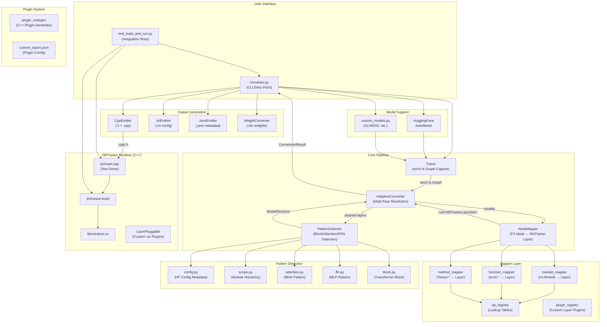

## 2. Class Diagram

```mermaid
classDiagram
    direction TB

    class Tracer {
        -root: nn.Module
        -graph: torch.fx.Graph
        -leaf_modules: tuple
        -_tensor_to_node: dict
        -_modules: dict
        -exclude_leaf_types: set
        +__init__(root, leaf_modules, exclude_leaf_types)
        +__torch_function__(func, types, args, kwargs)
        +__enter__()
        +__exit__(exc_type, exc_val, exc_tb)
        +get_leaf_modules() dict
        +print_graph_summary()
    }
    Tracer --|> TorchFunctionMode : inherits

    class AdaptiveConverter {
        -model: nn.Module
        -model_config: Any
        -training: bool
        +__init__(model, model_config, training, plugin_registry)
        +convert(input_kwargs, max_passes) ConversionResult
        -_remove_passthrough_layers(layers, type, label)
        -_remove_position_id_chains(layers)
    }

    class ConversionResult {
        +layers: List~NNTrainerLayerDef~
        +decomposed_module_types: Set~str~
        +unsupported_ops: List
        +unknown_layers: List
        +tensor_ops: List
        +lazy_chains: List~LazyTensorChain~
        +graph: torch.fx.Graph
        +model_structure: ModelStructure
        +training: bool
        +is_fully_mapped: bool
        +summary()
    }

    class LazyTensorChain {
        +ops: List
        +to_cpp_chain(input_var) str
    }

    class NodeMapper {
        -model: nn.Module
        -graph: torch.fx.Graph
        -model_config: Any
        -node_to_layer: dict
        +__init__(model, graph, model_config)
        +map_all() List~NNTrainerLayerDef~
        +get_unknown_layers() List
        +get_unknown_module_types() Set~str~
        -_map_node(node) NNTrainerLayerDef
    }

    class NNTrainerLayerDef {
        +layer_type: str
        +name: str
        +properties: dict
        +input_layers: list
        +fx_node_name: str
        +hf_module_name: str
        +hf_module_type: str
        +has_weight: bool
        +has_bias: bool
        +weight_hf_key: str
        +bias_hf_key: str
        +transpose_weight: bool
        +shared_from: str
        +to_properties_list() list
        +to_cpp_call() str
    }

    class PatternDetector {
        -layers: List~NNTrainerLayerDef~
        -model_config: Any
        +__init__(layers, model_config)
        +detect() ModelStructure
    }

    class ModelStructure {
        +arch_type: str
        +model_type: str
        +embedding: dict
        +blocks: List~TransformerBlockPattern~
        +lm_head: dict
        +final_norm: dict
        +tie_word_embeddings: bool
        +vocab_size: int
        +hidden_size: int
        +num_layers: int
        +num_heads: int
        +num_kv_heads: int
        +head_dim: int
        +intermediate_size: int
        +rope_theta: float
        +norm_eps: float
        +num_encoder_layers: int
        +num_decoder_layers: int
    }

    class TransformerBlockPattern {
        +block_idx: int
        +block_role: str
        +pre_attn_norm: dict
        +attention: AttentionPattern
        +post_attn_norm: dict
        +attn_residual: dict
        +pre_ffn_norm: dict
        +ffn: FFNPattern
        +post_ffn_norm: dict
        +ffn_residual: dict
        +norm_type: str
        +cross_attention: AttentionPattern
        +operator_type: str
    }

    class AttentionPattern {
        +block_idx: int
        +q_proj: str
        +k_proj: str
        +v_proj: str
        +o_proj: str
        +q_norm: str
        +k_norm: str
        +sdpa: str
        +attention_type: str
        +num_heads: int
        +num_kv_heads: int
        +head_dim: int
        +has_rope: bool
        +has_qk_norm: bool
        +layer_names: list
    }

    class FFNPattern {
        +block_idx: int
        +ffn_type: str
        +gate_proj: str
        +up_proj: str
        +down_proj: str
        +activation: str
        +gate_multiply: str
        +intermediate_size: int
        +layer_names: list
    }

    class BaseEmitter {
        <<abstract>>
        #layers: List~NNTrainerLayerDef~
        #structure: ModelStructure
        #model_name: str
        +__init__(layers, structure, model_name)
        +emit()* str
        +format_property(key, value)$ str
    }

    class CppEmitter {
        +emit() str
        +emit_header() str
        +emit_source() str
    }

    class IniEmitter {
        -batch_size: int
        +emit(mode) str
    }

    class JsonEmitter {
        +emit() dict
        +emit_string(indent) str
    }

    class WeightConverter {
        -layers: List~NNTrainerLayerDef~
        -weight_map: WeightMap
        +__init__(layers)
        +convert(state_dict, output_path, dtype)
        +convert_from_pretrained(model_path, output_path, dtype)
        +generate_script() str
    }

    class WeightMap {
        -entries: list
        +add(hf_key, nntr_layer, transform, is_bias)
        +__iter__()
        +__len__()
    }

    class PluginRegistry {
        -_entries: list
        +register(matcher, spec)
        +register_simple(matcher, type, kwargs)
        +lookup(module) CustomLayerSpec
        +map_module(module, name, inputs) NNTrainerLayerDef
        +registered_types: list
        +from_config(path)$ PluginRegistry
    }

    class CustomLayerSpec {
        +nntrainer_type: str
        +property_mapper: Callable
        +weight_keys: dict
        +has_weight: bool
        +has_bias: bool
        +transpose_weight: bool
        +supports_training: bool
        +description: str
        +pluggable_so: str
    }

    class PluginCodegen {
        <<module>>
        +generate_header(type, class_name, properties) str
        +generate_source(type, class_name, properties) str
        +generate_meson_build(type) str
        +generate_plugin_code(type, output_dir) dict
    }

    %% Relationships
    AdaptiveConverter --> Tracer : creates & uses
    AdaptiveConverter --> NodeMapper : creates & uses
    AdaptiveConverter --> PatternDetector : creates & uses
    AdaptiveConverter --> ConversionResult : produces
    AdaptiveConverter --> LazyTensorChain : detects
    NodeMapper --> NNTrainerLayerDef : produces
    PatternDetector --> ModelStructure : produces
    ModelStructure --> TransformerBlockPattern : contains 0..*
    TransformerBlockPattern --> AttentionPattern : contains
    TransformerBlockPattern --> FFNPattern : contains
    ConversionResult --> ModelStructure : references
    ConversionResult --> NNTrainerLayerDef : contains 0..*
    ConversionResult --> LazyTensorChain : contains 0..*

    CppEmitter --|> BaseEmitter : inherits
    IniEmitter --|> BaseEmitter : inherits
    JsonEmitter --|> BaseEmitter : inherits
    BaseEmitter --> NNTrainerLayerDef : uses
    BaseEmitter --> ModelStructure : uses
    WeightConverter --> WeightMap : creates
    WeightConverter --> NNTrainerLayerDef : reads
    AdaptiveConverter --> PluginRegistry : optional
    PluginRegistry --> CustomLayerSpec : contains 0..*
    PluginRegistry --> NNTrainerLayerDef : produces
    PluginCodegen --> CustomLayerSpec : reads
```

### Mapper Dispatch Detail

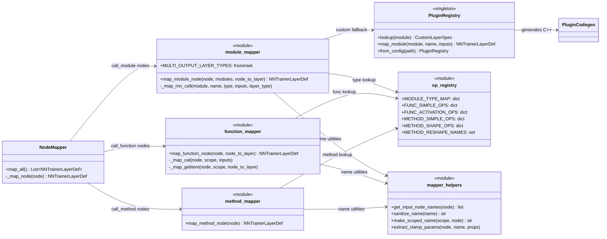

## 3. Sequence Diagram — Full Conversion Pipeline

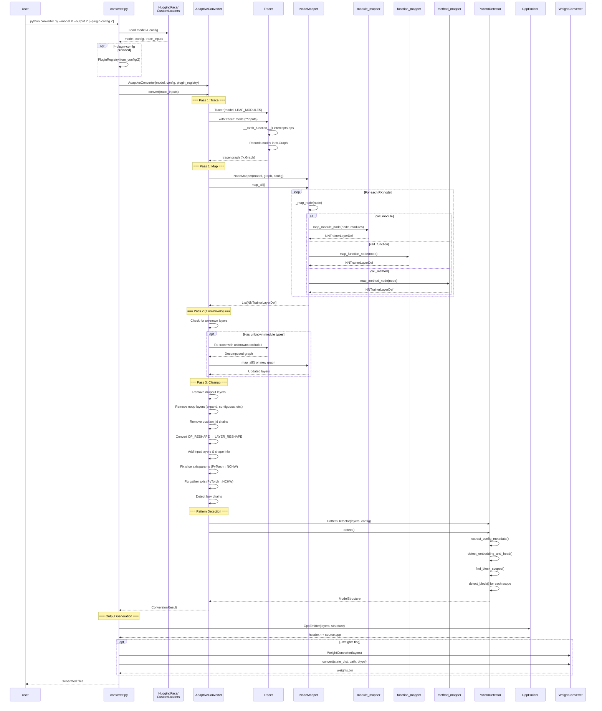

### Sequence Diagram — Build & Run Integration Test

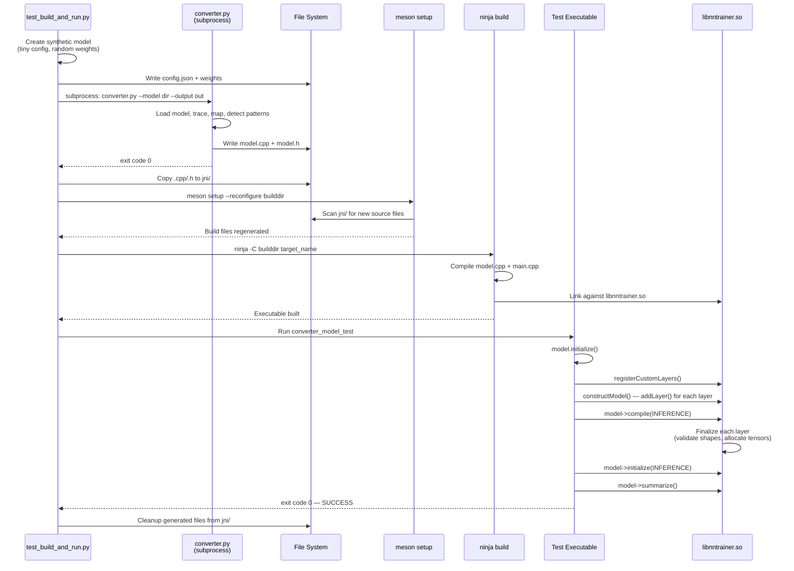

## 4. Data Flow Diagram

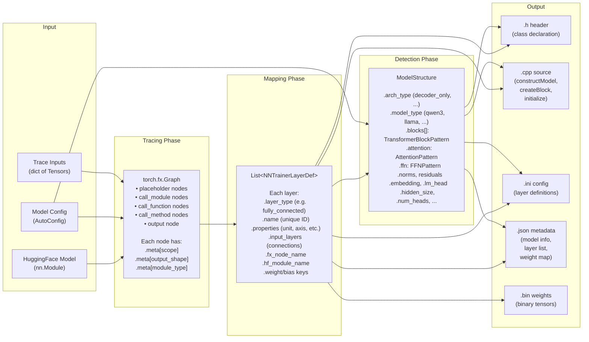

## 5. NNTrainer Symbolic Tensor Graph — Class Diagram

The generated C++ code uses the symbolic tensor graph API. This diagram shows
the runtime class relationships in NNTrainer (C++ side).

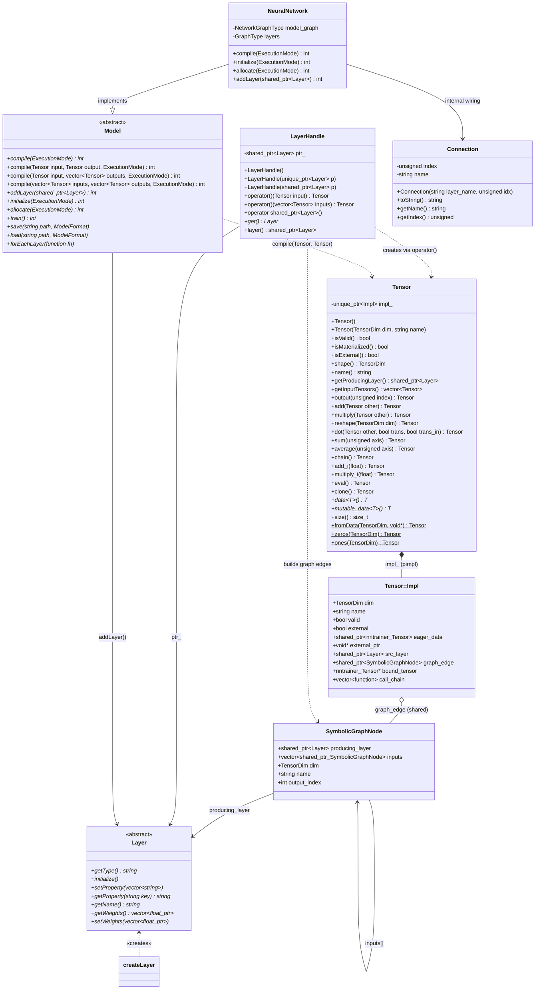

### Key Design Patterns

| Pattern | Where | Why |
|---|---|---|
| **Pimpl** | `Tensor → Impl` | Hide C++ internals from public API |
| **Shared graph edges** | `shared_ptr<SymbolicGraphNode>` | Avoid O(N!) deep copy on Tensor copy |
| **Callable wrapper** | `LayerHandle::operator()` | Enable `h = fc(x)` graph construction syntax |
| **Two-phase compile** | Symbolic graph → `compile(Tensor,Tensor)` | Decouple graph definition from execution |

## 6. NNTrainer Symbolic Tensor Graph — Sequence Diagrams

### 6.1 Model Construction (Graph Building Phase)

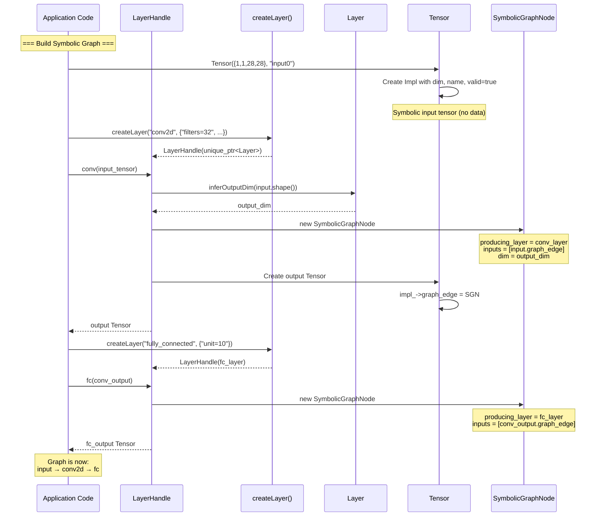

### 6.2 Model Construction — Multi-Input (Residual / Concat)

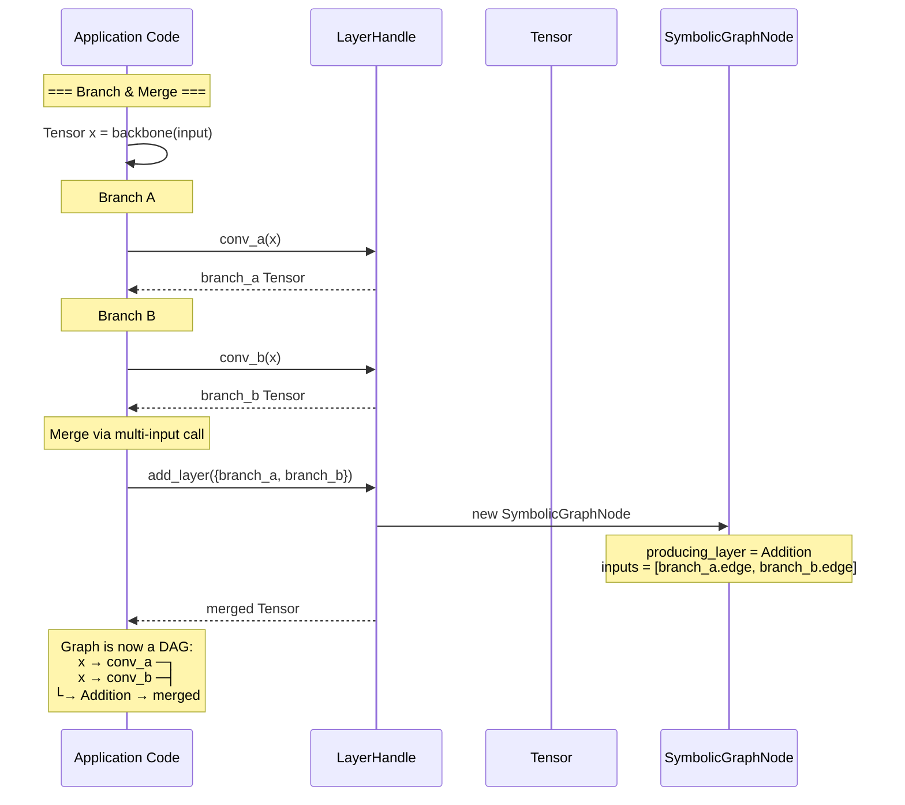

### 6.3 Model Compilation (Graph Extraction Phase)

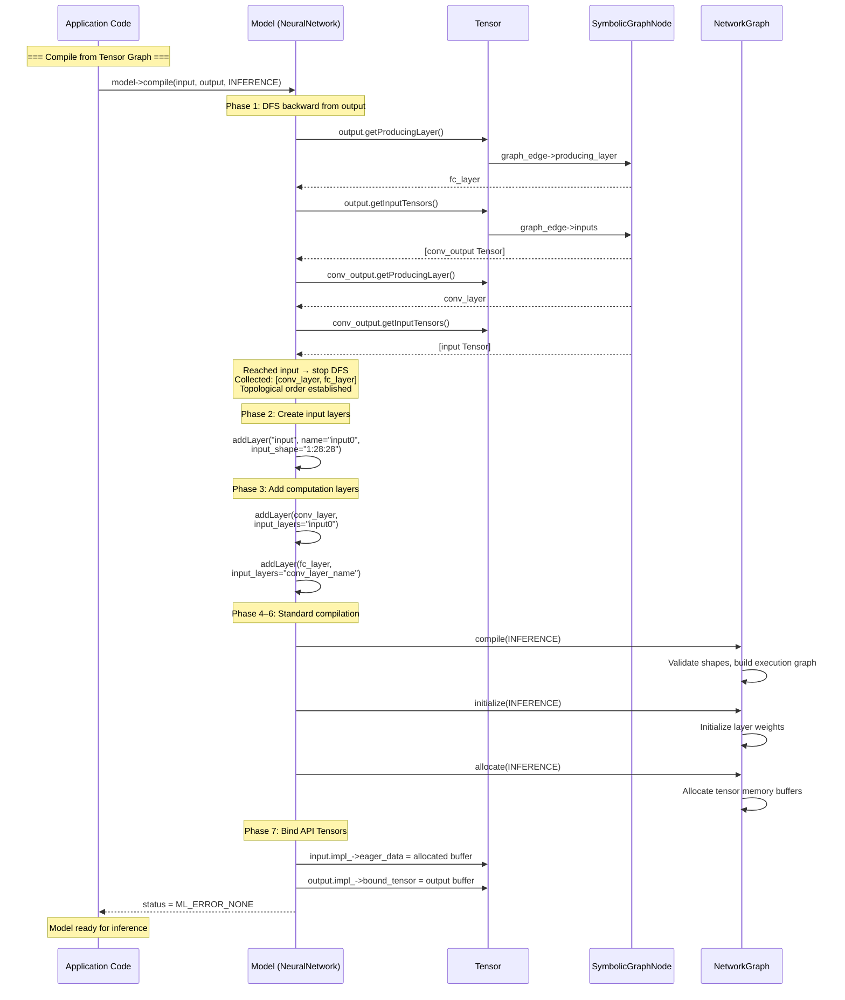

### 6.4 End-to-End: TorchFXConverter → C++ Build → Inference

```mermaid
sequenceDiagram
    participant User
    participant Conv as TorchFXConverter<br/>(Python)
    participant Emitter as CppEmitter
    participant FS as Generated Files
    participant Build as meson + ninja
    participant App as Generated C++ App
    participant NNTR as libnntrainer.so

    User->>Conv: converter.py --model qwen3 --format cpp

    Note over Conv: Trace → Map → Detect Patterns
    Conv->>Emitter: emit(layers, structure)

    Note over Emitter: Generate symbolic tensor graph code
    Emitter->>FS: model.h (class decl)
    Emitter->>FS: model.cpp containing:

    Note over FS: constructModel() {<br/>  Tensor input = input_layer(Tensor());<br/>  Tensor x = embedding(input);<br/>  for (i : layers)<br/>    x = createBlock(i, x);<br/>  Tensor out = lmhead(x);<br/>  model->compile(input, out);<br/>}

    Conv->>FS: weights.bin (optional)

    User->>Build: meson setup && ninja
    Build->>Build: Compile model.cpp + main.cpp
    Build->>NNTR: Link libnntrainer.so

    User->>App: ./model_test

    Note over App: 1. constructModel()
    App->>App: Build symbolic Tensor graph
    App->>NNTR: model->compile(input, output)

    Note over NNTR: DFS graph extraction<br/>→ addLayer() for each<br/>→ compile → init → allocate

    NNTR-->>App: Model compiled

    Note over App: 2. Inference
    App->>App: Fill input tensor with token IDs
    App->>NNTR: model->incremental_inference()
    NNTR-->>App: Output logits
    App->>App: argmax → next token
```

## 7. NNTrainer Layer Type Mapping

Key PyTorch → NNTrainer layer type mappings used by the converter:

| PyTorch Operation | NNTrainer Layer | Properties |
|---|---|---|
| `nn.Linear` | `fully_connected` | unit, disable_bias |
| `nn.Embedding` | `embedding_layer` | in_dim, out_dim |
| `nn.LayerNorm` | `layer_normalization` | axis=3, epsilon |
| `RMSNorm` | `rms_norm` | epsilon, packed |
| `nn.Conv1d` | `conv1d` | filters, kernel_size, stride, padding |
| `nn.Conv2d` | `conv2d` | filters, kernel_size, stride, padding |
| `nn.ConvTranspose2d` | `conv2dtranspose` | filters, kernel_size, stride, padding |
| `nn.Conv2d` (depthwise) | `depthwiseconv2d` | filters, kernel_size, stride, padding |
| `nn.Upsample` | `upsample2d` | upsample, kernel_size |
| `nn.MaxPool2d/AvgPool2d` | `pooling2d` | pooling, pool_size, stride |
| `nn.BatchNorm1d/2d` | `batch_normalization` | epsilon, momentum |
| `nn.GroupNorm` | `group_normalization` | num_groups, epsilon |
| `nn.InstanceNorm1d/2d` | `instance_normalization` | epsilon |
| `nn.Dropout` | `dropout` | dropout_rate |
| `nn.ReLU/GELU/SiLU` | `activation` | activation type |
| `nn.MultiheadAttention` | `multi_head_attention` | num_heads, projected_key_dim |
| `nn.ChannelShuffle` | `channel_shuffle` | split_number |
| `nn.GRU/LSTM/RNN` | `gru`/`lstm`/`rnn` | unit, return_sequences |
| `nn.GRUCell/LSTMCell/RNNCell` | `grucell`/`lstmcell`/`rnncell` | unit |
| `nn.Identity` | `identity` | — |
| `nn.CrossEntropyLoss` | `cross_softmax` | — |
| `nn.MSELoss` | `mse` | — |
| `nn.KLDivLoss` | `kld` | — |
| `nn.BCEWithLogitsLoss` | `cross_sigmoid` | — |
| `torch.cat` | `concat` | axis |
| `torch.gather` | `gather` | axis (1-3, NCHW) |
| `torch.topk` | `topk` | — |
| `Tensor.argsort` | `argsort` | — |
| `Tensor.view/reshape` | `reshape` | target_shape (C:H:W) |
| `Tensor.__getitem__` | `slice` | axis, start_index, end_index |
| `Tensor.mul` | `multiply` | (broadcasting supported) |
| `Tensor.add` | `addition` | — |
| `Tensor.softmax` | `activation` | activation=softmax |
| `Tensor.permute` | `permute` | — |
| `Tensor.transpose` | `transpose` | — |
| `F.cross_entropy` | `cross_softmax` | — |
| `F.mse_loss` | `mse` | — |
| `F.normalize` | `preprocess_l2norm` | epsilon |
| Custom (via plugin) | user-defined | user-defined |

### NCHW Dimension Convention

NNTrainer uses 4D `[Batch, Channel, Height, Width]` tensors. PyTorch tensors are mapped as:

| PyTorch Rank | NCHW Mapping | Axis Shift (dim > 0) |
|---|---|---|
| 4D `[B,C,H,W]` | Direct | +0 |
| 3D `[B,H,W]` | `[B, 1, H, W]` | +1 |
| 2D `[B,W]` | `[B, 1, 1, W]` | +2 |

Formula: `nchw_axis = pytorch_dim + (4 - tensor_rank)` for dims > 0.

## 8. Plugin System — Custom LayerPluggable Support

The converter supports user-defined custom layer mappings via the Plugin System,
which integrates with NNTrainer's `LayerPluggable` interface for dynamic layer loading.

### Architecture

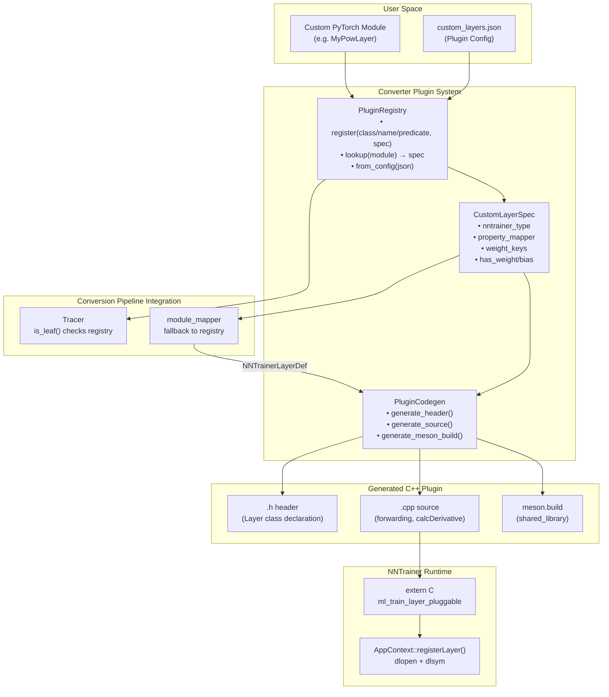

### Usage

**Method 1: Programmatic Registration**

```python
from plugin_registry import PluginRegistry, CustomLayerSpec
from decomposer import AdaptiveConverter

registry = PluginRegistry()
registry.register(MyPowLayer, CustomLayerSpec(
    nntrainer_type="custom_pow",
    property_mapper=lambda m: {"exponent": m.exponent},
))

converter = AdaptiveConverter(model, plugin_registry=registry)
result = converter.convert(inputs)
```

**Method 2: JSON Config File**

```json
{
  "custom_layers": [
    {
      "match_class_name": "MyPowLayer",
      "nntrainer_type": "custom_pow",
      "properties": {"exponent": 2},
      "has_weight": false
    }
  ]
}
```

```bash
python converter.py --model ./my_model --output ./out --plugin-config custom_layers.json
```

**Method 3: Generate C++ Plugin Boilerplate**

```python
from plugin_codegen import generate_plugin_code

generate_plugin_code(
    layer_type="custom_pow",
    properties={"exponent": "float"},
    has_weight=False,
    output_dir="./my_plugin/",
)
# Generates: custom_pow_layer.h, custom_pow_layer.cpp, meson.build
```

### NNTrainer LayerPluggable Interface

Custom layers must implement:

| Method | Purpose |
|---|---|
| `getType()` | Return layer type string (e.g. `"custom_pow"`) |
| `finalize(InitLayerContext&)` | Set output dimensions, request weights |
| `forwarding(RunLayerContext&, bool)` | Forward propagation |
| `calcDerivative(RunLayerContext&)` | Backward propagation |
| `setProperty(vector<string>&)` | Parse `key=value` properties |
| `supportBackwarding()` | Whether layer supports training |

The generated `.so` plugin exposes `extern "C" LayerPluggable ml_train_layer_pluggable`
which NNTrainer discovers via `AppContext::registerLayer()` (dlopen/dlsym).
