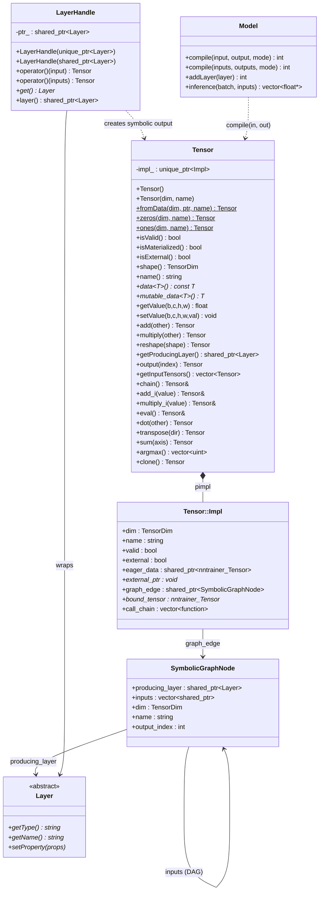
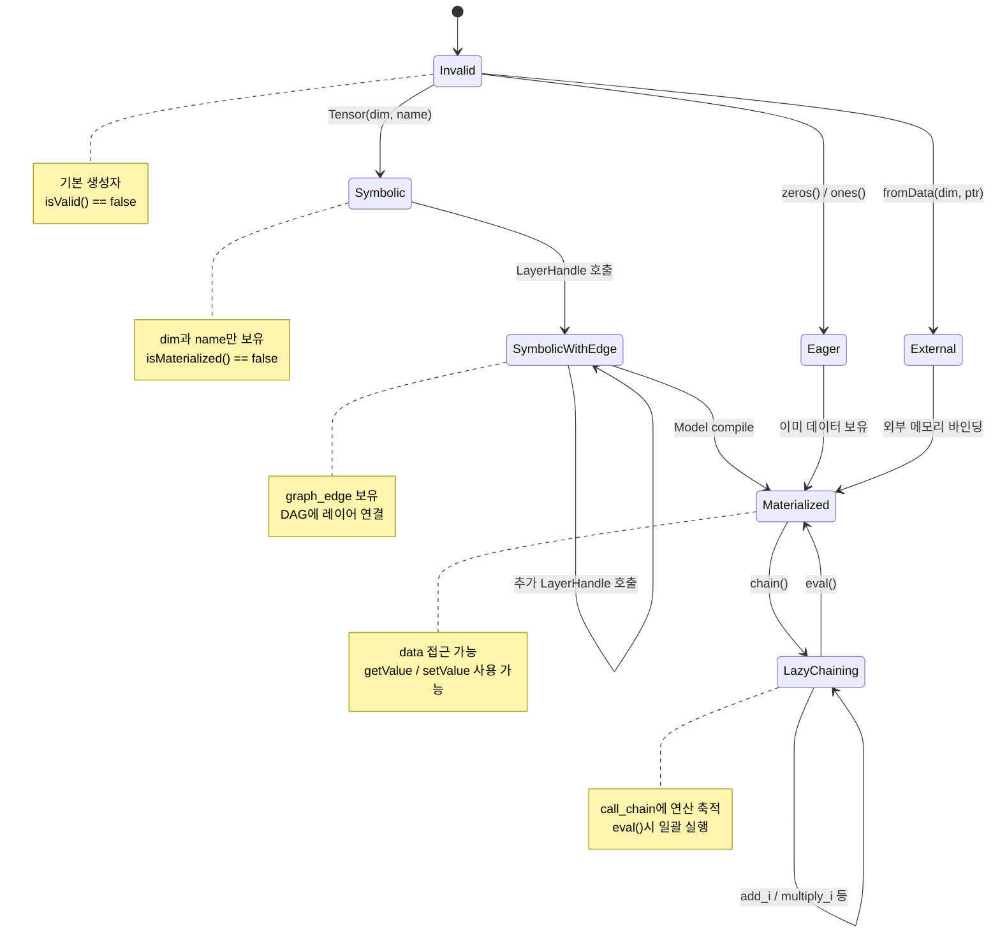
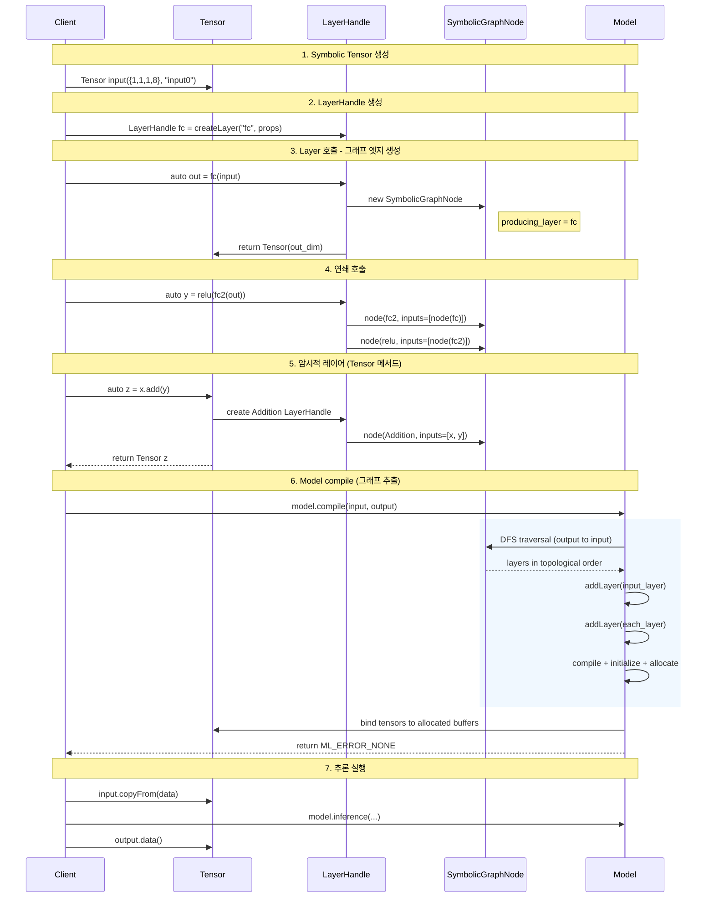
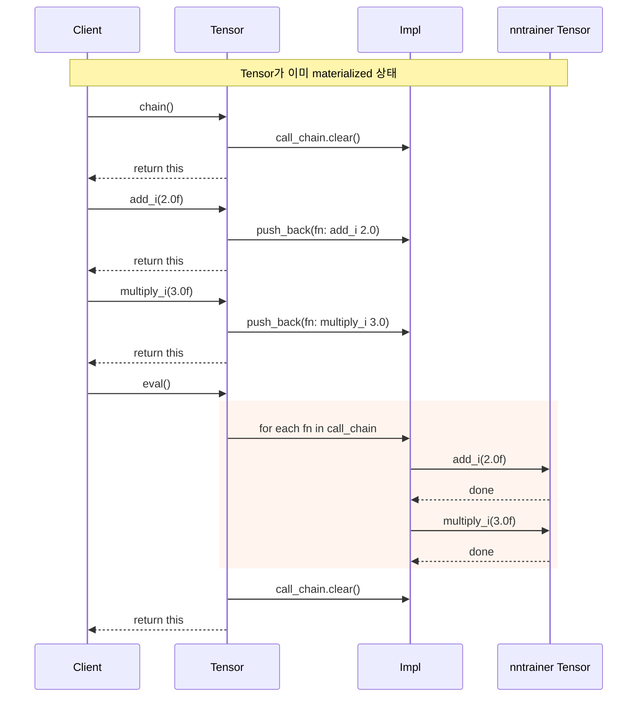
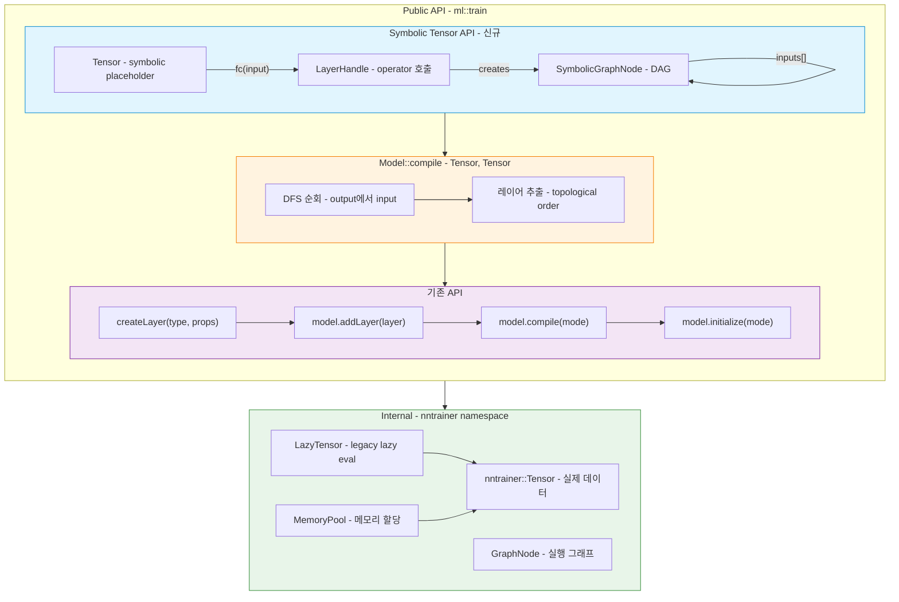
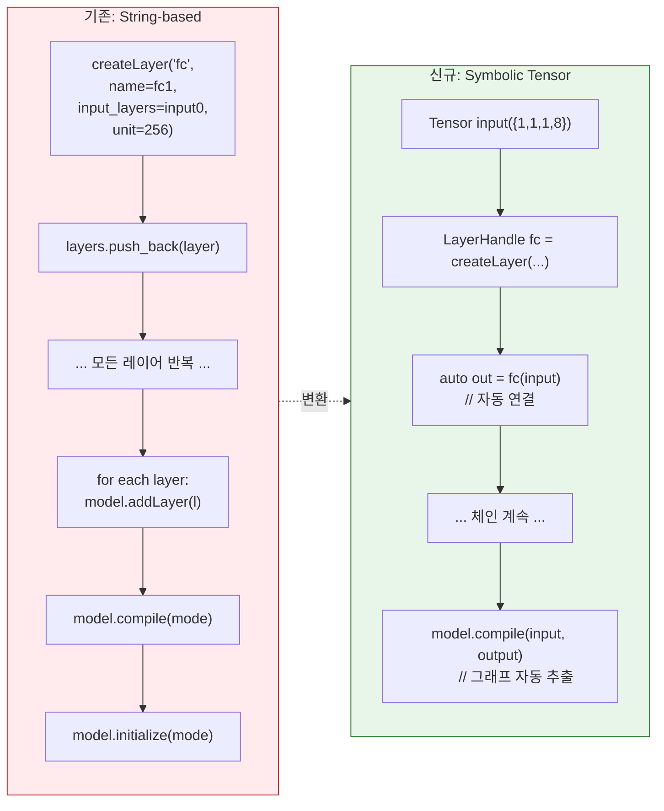

# Symbolic Tensor API

> **Status**: Experimental (`ml::train` namespace)
> **Minimum C++ Version**: C++17

NNTrainer의 Symbolic Tensor API는 PyTorch/Keras 스타일의 함수형 모델 정의를 C++에서 가능하게 합니다. 기존의 문자열 기반 `addLayer()` 방식 대신, **텐서를 인자로 레이어를 호출**하여 연산 그래프를 구성하고, `Model::compile(input, output)`으로 자동 추출합니다.

## 목차

- [Quick Start](#quick-start)
- [핵심 개념](#핵심-개념)
- [API Reference](#api-reference)
  - [Tensor](#tensor)
  - [LayerHandle](#layerhandle)
  - [Model::compile 오버로드](#modelcompile-오버로드)
- [Lazy Chaining](#lazy-chaining)
- [아키텍처 다이어그램](#아키텍처-다이어그램)
  - [Class Diagram](#class-diagram)
  - [Tensor 생명주기 (State Diagram)](#tensor-생명주기)
  - [그래프 구성 및 컴파일 (Sequence Diagram)](#그래프-구성-및-컴파일)
  - [Lazy Chaining (Sequence Diagram)](#lazy-chaining-sequence)
  - [API 레벨 비교 (Component Diagram)](#api-레벨-비교)
  - [String-based vs Symbolic 비교](#string-based-vs-symbolic-비교)
- [실전 예제](#실전-예제)
- [파일 위치](#파일-위치)

---

## Quick Start

```cpp
#include <tensor_api.h>
#include <model.h>

using namespace ml::train;

// 1. 심볼릭 입력 텐서 생성
Tensor input({1, 1, 1, 784}, "input");

// 2. 레이어를 LayerHandle로 감싸서 호출
LayerHandle fc1 = createLayer("fully_connected", {"unit=128", "name=fc1"});
LayerHandle relu = createLayer("activation", {"activation=relu", "name=relu1"});
LayerHandle fc2 = createLayer("fully_connected", {"unit=10", "name=fc2"});

auto h = fc1(input);
h = relu(h);
auto output = fc2(h);

// 3. 모델에 입출력 텐서를 전달하여 그래프 자동 추출 + 컴파일
auto model = createModel(ModelType::NEURAL_NET, {"batch_size=1"});
model->compile(input, output);  // compile + initialize + allocate 한번에

// 4. 추론
float data[784] = { /* ... */ };
input.copyFrom(data);
auto results = model->inference(1, {data});
```

---

## 핵심 개념

| 개념 | 설명 |
|------|------|
| **Symbolic Tensor** | 차원과 이름만 가진 플레이스홀더. 실제 데이터 없음 |
| **Eager Tensor** | `zeros()`, `ones()`, `fromData()`로 생성. 즉시 데이터 보유 |
| **LayerHandle** | `createLayer()` 결과를 감싸고, `operator()`로 그래프 엣지 생성 |
| **SymbolicGraphNode** | 내부 DAG 노드. producing_layer + inputs로 그래프 구성 |
| **Materialization** | `Model::compile()` 후 심볼릭 텐서가 실제 메모리에 바인딩됨 |
| **Lazy Chaining** | `chain().add_i().multiply_i().eval()`로 연산을 지연 실행 |

---

## API Reference

### Tensor

#### 생성

```cpp
// 심볼릭 텐서 (그래프 플레이스홀더)
Tensor input(TensorDim({1, 1, 28, 28}), "input");

// Eager 텐서 (즉시 데이터 보유)
auto zeros = Tensor::zeros({1, 1, 3, 3});
auto ones  = Tensor::ones({1, 1, 3, 3});

// 외부 메모리 래핑 (zero-copy)
float buf[12];
auto ext = Tensor::fromData({1, 1, 3, 4}, buf, "cache");
```

#### 상태 조회

| 메서드 | 반환 | 설명 |
|--------|------|------|
| `isValid()` | `bool` | 유효하게 생성되었는지 |
| `isMaterialized()` | `bool` | 실제 데이터에 접근 가능한지 |
| `isExternal()` | `bool` | `fromData()`로 생성된 외부 메모리인지 |
| `shape()` | `TensorDim` | 텐서 차원 |
| `name()` | `string` | 텐서 이름 |
| `dtype()` | `DataType` | 데이터 타입 (기본 FP32) |

#### 데이터 접근 (Materialized 상태 필요)

```cpp
const float *ptr = tensor.data<float>();      // 읽기 전용
float *mptr = tensor.mutable_data<float>();    // 쓰기 가능
float val = tensor.getValue(b, c, h, w);       // 개별 값 읽기
tensor.setValue(b, c, h, w, 42.0f);            // 개별 값 쓰기
tensor.copyFrom(src_buffer);                    // 외부 버퍼에서 복사
```

#### 심볼릭 연산 (암시적 레이어 생성)

```cpp
auto c = a.add(b);       // Addition 레이어 자동 생성
auto c = a.multiply(b);  // Multiply 레이어 자동 생성
auto y = x.reshape(dim); // Reshape 레이어 자동 생성
```

#### Eager 연산 (새 텐서 반환)

```cpp
auto r = t.add(5.0f);           // 스칼라 덧셈
auto r = t.subtract(other);     // 텐서 뺄셈
auto r = t.multiply(3.0f);      // 스칼라 곱셈
auto r = t.divide(other);       // 텐서 나눗셈
auto r = t.dot(other);          // 행렬 곱
auto r = t.transpose("0:2:1");  // 전치
auto r = t.pow(2.0f);           // 거듭제곱
auto r = t.sum(axis);           // 축 합산
auto r = t.average();           // 전체 평균
float n = t.l2norm();           // L2 노름
auto ids = t.argmax();          // 최대값 인덱스
```

#### 그래프 탐색

```cpp
auto layer = output.getProducingLayer();   // 이 텐서를 생성한 레이어
auto inputs = output.getInputTensors();    // 입력 텐서들
auto out0 = split_out.output(0);           // 다중 출력 레이어의 i번째 출력
```

### LayerHandle

```cpp
// createLayer 결과를 직접 대입 (암시적 변환)
LayerHandle fc = createLayer("fully_connected", {"unit=256", "name=fc1"});

// 단일 입력
auto output = fc(input);

// 다중 입력 (MHA 등)
auto attn = mha({q, k, v});

// Layer 속성 접근
fc->getName();   // "fc1"
fc->getType();   // "fully_connected"
```

### Model::compile 오버로드

```cpp
// 단일 입력, 단일 출력
model->compile(input, output);

// 단일 입력, 다중 출력
model->compile(input, {out1, out2});

// 다중 입력, 다중 출력
model->compile({in1, in2}, {out1, out2});

// ExecutionMode 지정
model->compile(input, output, ExecutionMode::INFERENCE);
```

---

## Lazy Chaining

Materialized 텐서에 대해 여러 in-place 연산을 **지연 실행**할 수 있습니다.

```cpp
auto t = Tensor::ones({1, 1, 2, 2});

// (1 + 2) * 3 - 1 = 8
t.chain()
  .add_i(2.0f)
  .multiply_i(3.0f)
  .subtract_i(1.0f)
  .eval();  // 여기서 일괄 실행

// 텐서 간 연산도 가능
auto other = Tensor::ones({1, 1, 2, 2});
t.chain().add_i(other, 0.5f).eval();
```

**지원 연산**: `add_i`, `subtract_i`, `multiply_i`, `divide_i`, `pow_i`, `inv_sqrt_i`

**규칙**:
- `chain()`은 이전 대기 연산을 초기화
- `eval()`은 대기열의 연산을 순서대로 실행한 후 대기열을 비움
- Materialized 상태가 아닌 텐서에 `eval()`을 호출하면 예외 발생

---

## 아키텍처 다이어그램

### Class Diagram



### Tensor 생명주기



### 그래프 구성 및 컴파일



### Lazy Chaining Sequence



### API 레벨 비교



### String-based vs Symbolic 비교



---

## 실전 예제

### Residual Connection (Skip Connection)

```cpp
using namespace ml::train;

auto x = Tensor({1, 1, 1, 256}, "input");

LayerHandle fc = createLayer("fully_connected", {"unit=256", "name=fc_res"});
auto h = fc(x);
auto out = x.add(h);  // implicit Addition layer

auto model = createModel(ModelType::NEURAL_NET, {"batch_size=1"});
model->compile(x, out);
```

### Transformer Decoder Block (CausalLM 패턴)

```cpp
using namespace ml::train;

const unsigned int DIM = 256, FF_DIM = 512, NUM_HEADS = 4;

Tensor input({1, 1, 1, 4}, "input0");

// Embedding
LayerHandle embedding = createLayer("fully_connected",
    {"name=embedding0", "unit=" + std::to_string(DIM), "disable_bias=true"});
Tensor x = embedding(input);

// Decoder block (반복 가능)
for (int i = 0; i < NUM_LAYERS; ++i) {
    std::string p = "layer" + std::to_string(i);

    // Attention
    LayerHandle att_norm = createLayer("layer_normalization",
        {"name=" + p + "_att_norm", "axis=3", "epsilon=1e-5"});
    Tensor normed = att_norm(x);

    LayerHandle q = createLayer("fully_connected",
        {"name=" + p + "_wq", "unit=" + std::to_string(DIM)});
    LayerHandle k = createLayer("fully_connected",
        {"name=" + p + "_wk", "unit=" + std::to_string(DIM)});
    LayerHandle v = createLayer("fully_connected",
        {"name=" + p + "_wv", "unit=" + std::to_string(DIM)});

    // Self-attention (Q, K, V all from same normed input)
    LayerHandle mha = createLayer("multi_head_attention",
        {"name=" + p + "_mha", "num_heads=" + std::to_string(NUM_HEADS)});
    auto attn_out = mha({q(normed), k(normed), v(normed)});

    // Residual
    Tensor residual = x.add(attn_out);

    // FFN
    LayerHandle ffn_norm = createLayer("layer_normalization",
        {"name=" + p + "_ffn_norm", "axis=3"});
    LayerHandle fc1 = createLayer("fully_connected",
        {"name=" + p + "_fc1", "unit=" + std::to_string(FF_DIM), "activation=gelu"});
    LayerHandle fc2 = createLayer("fully_connected",
        {"name=" + p + "_fc2", "unit=" + std::to_string(DIM)});

    auto ffn_out = fc2(fc1(ffn_norm(residual)));

    // Residual
    x = residual.add(ffn_out);
}

// Final norm + LM head
LayerHandle final_norm = createLayer("layer_normalization", {"name=final_norm"});
LayerHandle lmhead = createLayer("fully_connected",
    {"name=lmhead", "unit=" + std::to_string(VOCAB_SIZE)});
Tensor output = lmhead(final_norm(x));

auto model = createModel(ModelType::NEURAL_NET, {"batch_size=1"});
model->compile(input, output, ExecutionMode::INFERENCE);
```

### External KV Cache (MHA with fromData)

```cpp
using namespace ml::train;

auto input = Tensor({1, 1, 4, 64}, "input");

// External memory for KV cache (zero-copy)
float key_buf[1 * 1 * 32 * 64] = {};
float val_buf[1 * 1 * 32 * 64] = {};
auto key_cache = Tensor::fromData({1, 1, 32, 64}, key_buf, "key_cache");
auto val_cache = Tensor::fromData({1, 1, 32, 64}, val_buf, "val_cache");

LayerHandle q_proj = createLayer("fully_connected", {"unit=64", "name=q_proj"});
LayerHandle k_proj = createLayer("fully_connected", {"unit=64", "name=k_proj"});
LayerHandle v_proj = createLayer("fully_connected", {"unit=64", "name=v_proj"});

LayerHandle mha = createLayer("multi_head_attention",
    {"name=mha", "num_heads=4"});

// Pass cache tensors as additional inputs
auto attn = mha({q_proj(input), k_proj(input), v_proj(input),
                  key_cache, val_cache});

auto model = createModel(ModelType::NEURAL_NET, {"batch_size=1"});
model->compile(input, attn);

// Cache tensors remain external — update directly
// key_cache.isExternal() == true
```

### Lazy Chaining (Post-processing)

```cpp
// 추론 후 결과 후처리
auto logits = /* model output tensor */;

// 지연 체인: (logits / temperature) + bias
logits.chain()
    .divide_i(temperature)
    .add_i(bias_tensor)
    .eval();

// softmax 등 추가 처리
auto probs = logits.apply([](float x) { return std::exp(x); });
```

---

## 파일 위치

| 컴포넌트 | 헤더 | 구현 |
|---------|------|------|
| Tensor, LayerHandle | `api/ccapi/include/tensor_api.h` | `api/ccapi/src/tensor_api.cpp` |
| SymbolicGraphNode | (internal) | `api/ccapi/src/tensor_api.cpp` |
| Model::compile (Tensor) | `api/ccapi/include/model.h` | `api/ccapi/src/tensor_api.cpp` |
| LazyTensor (internal) | `nntrainer/tensor/lazy_tensor.h` | `nntrainer/tensor/lazy_tensor.cpp` |
| Unit Tests | | `test/ccapi/unittest_ccapi_tensor.cpp` |
| CausalLM Example | `Applications/CausalLM/causal_lm.h` | |
