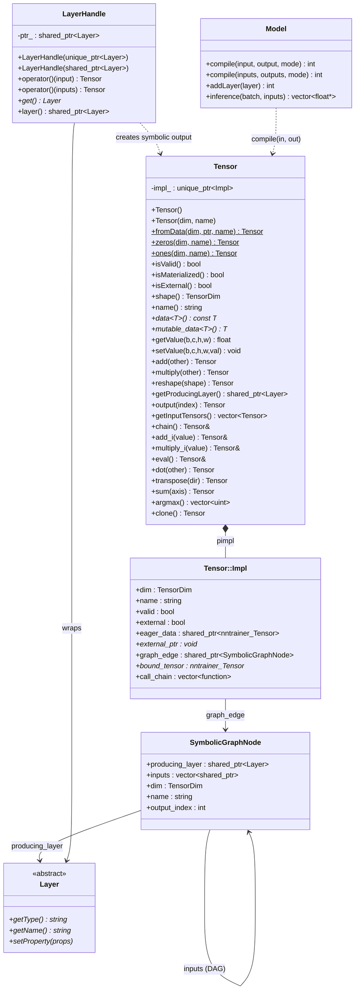
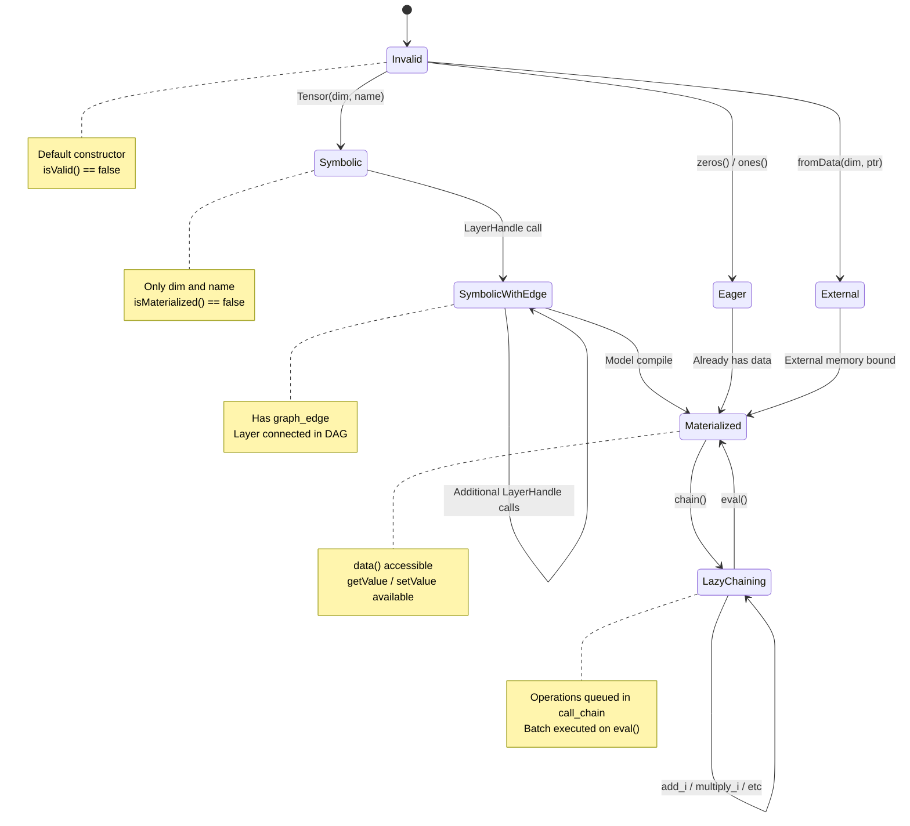
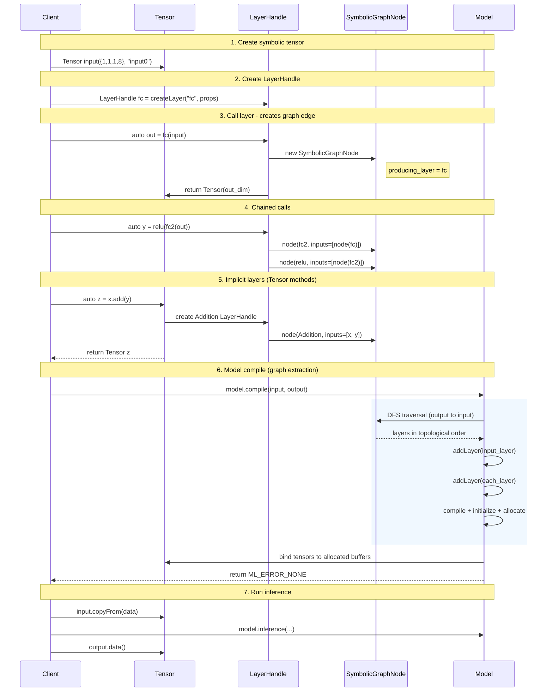
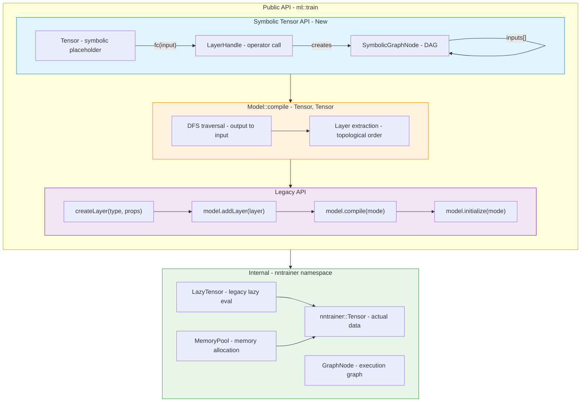
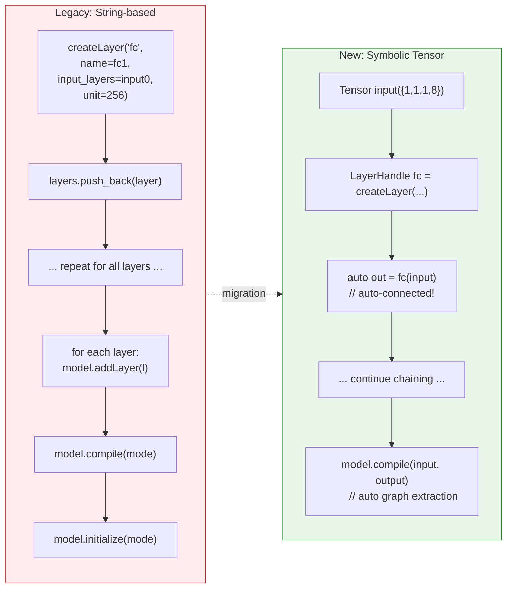

# Symbolic Tensor API

> **Status**: Experimental (`ml::train` namespace)
> **Minimum C++ Version**: C++17

NNTrainer's Symbolic Tensor API enables PyTorch/Keras-style functional model definition in C++. Instead of the traditional string-based `addLayer()` approach, you **call layers with tensors as arguments** to construct a computation graph, then extract it automatically via `Model::compile(input, output)`.

## Table of Contents

- [Quick Start](#quick-start)
- [Core Concepts](#core-concepts)
- [API Reference](#api-reference)
  - [Tensor](#tensor)
  - [LayerHandle](#layerhandle)
  - [Model::compile Overloads](#modelcompile-overloads)
- [Lazy Chaining](#lazy-chaining)
- [Architecture Diagrams](#architecture-diagrams)
  - [Class Diagram](#class-diagram)
  - [Tensor Lifecycle (State Diagram)](#tensor-lifecycle)
  - [Graph Construction & Compilation (Sequence Diagram)](#graph-construction--compilation)
  - [Lazy Chaining (Sequence Diagram)](#lazy-chaining-sequence)
  - [API Level Comparison (Component Diagram)](#api-level-comparison)
  - [String-based vs Symbolic](#string-based-vs-symbolic)
- [Examples](#examples)
- [File Locations](#file-locations)

---

## Quick Start

```cpp
#include <tensor_api.h>
#include <model.h>

using namespace ml::train;

// 1. Create symbolic input tensor
Tensor input({1, 1, 1, 784}, "input");

// 2. Wrap layers in LayerHandle and call them
LayerHandle fc1 = createLayer("fully_connected", {"unit=128", "name=fc1"});
LayerHandle relu = createLayer("activation", {"activation=relu", "name=relu1"});
LayerHandle fc2 = createLayer("fully_connected", {"unit=10", "name=fc2"});

auto h = fc1(input);
h = relu(h);
auto output = fc2(h);

// 3. Pass input/output tensors to auto-extract graph + compile
auto model = createModel(ModelType::NEURAL_NET, {"batch_size=1"});
model->compile(input, output);  // compile + initialize + allocate in one call

// 4. Run inference
float data[784] = { /* ... */ };
input.copyFrom(data);
auto results = model->inference(1, {data});
```

---

## Core Concepts

| Concept | Description |
|---------|-------------|
| **Symbolic Tensor** | A placeholder with only shape and name. No actual data. |
| **Eager Tensor** | Created via `zeros()`, `ones()`, `fromData()`. Holds data immediately. |
| **LayerHandle** | Wraps `createLayer()` result; `operator()` creates graph edges. |
| **SymbolicGraphNode** | Internal DAG node. Stores producing_layer + inputs. |
| **Materialization** | After `Model::compile()`, symbolic tensors are bound to real memory. |
| **Lazy Chaining** | Deferred execution via `chain().add_i().multiply_i().eval()`. |

---

## API Reference

### Tensor

#### Construction

```cpp
// Symbolic tensor (graph placeholder)
Tensor input(TensorDim({1, 1, 28, 28}), "input");

// Eager tensors (immediate data)
auto zeros = Tensor::zeros({1, 1, 3, 3});
auto ones  = Tensor::ones({1, 1, 3, 3});

// Wrap external memory (zero-copy)
float buf[12];
auto ext = Tensor::fromData({1, 1, 3, 4}, buf, "cache");
```

#### State Queries

| Method | Returns | Description |
|--------|---------|-------------|
| `isValid()` | `bool` | Whether the tensor has been properly constructed |
| `isMaterialized()` | `bool` | Whether actual data is accessible |
| `isExternal()` | `bool` | Whether it wraps user-managed memory via `fromData()` |
| `shape()` | `TensorDim` | Tensor dimensions |
| `name()` | `string` | Tensor name |
| `dtype()` | `DataType` | Data type (default FP32) |

#### Data Access (Requires Materialized State)

```cpp
const float *ptr = tensor.data<float>();      // Read-only access
float *mptr = tensor.mutable_data<float>();    // Mutable access
float val = tensor.getValue(b, c, h, w);       // Read single value
tensor.setValue(b, c, h, w, 42.0f);            // Write single value
tensor.copyFrom(src_buffer);                    // Copy from external buffer
```

#### Symbolic Operations (Create Implicit Layers)

```cpp
auto c = a.add(b);       // Creates an implicit Addition layer
auto c = a.multiply(b);  // Creates an implicit Multiply layer
auto y = x.reshape(dim); // Creates an implicit Reshape layer
```

#### Eager Operations (Return New Tensors)

```cpp
auto r = t.add(5.0f);           // Scalar addition
auto r = t.subtract(other);     // Tensor subtraction
auto r = t.multiply(3.0f);      // Scalar multiplication
auto r = t.divide(other);       // Tensor division
auto r = t.dot(other);          // Matrix multiplication
auto r = t.transpose("0:2:1");  // Transpose
auto r = t.pow(2.0f);           // Power
auto r = t.sum(axis);           // Sum along axis
auto r = t.average();           // Global average
float n = t.l2norm();           // L2 norm
auto ids = t.argmax();          // Argmax indices
```

#### Graph Traversal

```cpp
auto layer = output.getProducingLayer();   // Layer that produced this tensor
auto inputs = output.getInputTensors();    // Input tensors to producing layer
auto out0 = split_out.output(0);           // i-th output of a multi-output layer
```

### LayerHandle

```cpp
// Directly assign from createLayer (implicit conversion)
LayerHandle fc = createLayer("fully_connected", {"unit=256", "name=fc1"});

// Single input
auto output = fc(input);

// Multiple inputs (e.g., MHA)
auto attn = mha({q, k, v});

// Access layer properties
fc->getName();   // "fc1"
fc->getType();   // "fully_connected"
```

### Model::compile Overloads

```cpp
// Single input, single output
model->compile(input, output);

// Single input, multiple outputs
model->compile(input, {out1, out2});

// Multiple inputs, multiple outputs
model->compile({in1, in2}, {out1, out2});

// Specify execution mode
model->compile(input, output, ExecutionMode::INFERENCE);
```

---

## Lazy Chaining

Queue multiple in-place operations on a materialized tensor for **deferred batch execution**.

```cpp
auto t = Tensor::ones({1, 1, 2, 2});

// (1 + 2) * 3 - 1 = 8
t.chain()
  .add_i(2.0f)
  .multiply_i(3.0f)
  .subtract_i(1.0f)
  .eval();  // All operations execute here

// Tensor-tensor operations are also supported
auto other = Tensor::ones({1, 1, 2, 2});
t.chain().add_i(other, 0.5f).eval();
```

**Supported operations**: `add_i`, `subtract_i`, `multiply_i`, `divide_i`, `pow_i`, `inv_sqrt_i`

**Rules**:
- `chain()` clears any previously queued operations
- `eval()` executes queued operations in order, then clears the queue
- Calling `eval()` on a non-materialized tensor throws `std::runtime_error`

---

## Architecture Diagrams

### Class Diagram



### Tensor Lifecycle



### Graph Construction & Compilation



### Lazy Chaining Sequence


### API Level Comparison



### String-based vs Symbolic



---

## Examples

### Residual Connection (Skip Connection)

```cpp
using namespace ml::train;

auto x = Tensor({1, 1, 1, 256}, "input");

LayerHandle fc = createLayer("fully_connected", {"unit=256", "name=fc_res"});
auto h = fc(x);
auto out = x.add(h);  // implicit Addition layer

auto model = createModel(ModelType::NEURAL_NET, {"batch_size=1"});
model->compile(x, out);
```

### Transformer Decoder Block (CausalLM Pattern)

```cpp
using namespace ml::train;

const unsigned int DIM = 256, FF_DIM = 512, NUM_HEADS = 4;

Tensor input({1, 1, 1, 4}, "input0");

// Embedding
LayerHandle embedding = createLayer("fully_connected",
    {"name=embedding0", "unit=" + std::to_string(DIM), "disable_bias=true"});
Tensor x = embedding(input);

// Decoder blocks (can be repeated)
for (int i = 0; i < NUM_LAYERS; ++i) {
    std::string p = "layer" + std::to_string(i);

    // Attention
    LayerHandle att_norm = createLayer("layer_normalization",
        {"name=" + p + "_att_norm", "axis=3", "epsilon=1e-5"});
    Tensor normed = att_norm(x);

    LayerHandle q = createLayer("fully_connected",
        {"name=" + p + "_wq", "unit=" + std::to_string(DIM)});
    LayerHandle k = createLayer("fully_connected",
        {"name=" + p + "_wk", "unit=" + std::to_string(DIM)});
    LayerHandle v = createLayer("fully_connected",
        {"name=" + p + "_wv", "unit=" + std::to_string(DIM)});

    // Self-attention (Q, K, V all from same normed input)
    LayerHandle mha = createLayer("multi_head_attention",
        {"name=" + p + "_mha", "num_heads=" + std::to_string(NUM_HEADS)});
    auto attn_out = mha({q(normed), k(normed), v(normed)});

    // Residual
    Tensor residual = x.add(attn_out);

    // FFN
    LayerHandle ffn_norm = createLayer("layer_normalization",
        {"name=" + p + "_ffn_norm", "axis=3"});
    LayerHandle fc1 = createLayer("fully_connected",
        {"name=" + p + "_fc1", "unit=" + std::to_string(FF_DIM), "activation=gelu"});
    LayerHandle fc2 = createLayer("fully_connected",
        {"name=" + p + "_fc2", "unit=" + std::to_string(DIM)});

    auto ffn_out = fc2(fc1(ffn_norm(residual)));

    // Residual
    x = residual.add(ffn_out);
}

// Final norm + LM head
LayerHandle final_norm = createLayer("layer_normalization", {"name=final_norm"});
LayerHandle lmhead = createLayer("fully_connected",
    {"name=lmhead", "unit=" + std::to_string(VOCAB_SIZE)});
Tensor output = lmhead(final_norm(x));

auto model = createModel(ModelType::NEURAL_NET, {"batch_size=1"});
model->compile(input, output, ExecutionMode::INFERENCE);
```

### External KV Cache (MHA with fromData)

```cpp
using namespace ml::train;

auto input = Tensor({1, 1, 4, 64}, "input");

// External memory for KV cache (zero-copy)
float key_buf[1 * 1 * 32 * 64] = {};
float val_buf[1 * 1 * 32 * 64] = {};
auto key_cache = Tensor::fromData({1, 1, 32, 64}, key_buf, "key_cache");
auto val_cache = Tensor::fromData({1, 1, 32, 64}, val_buf, "val_cache");

LayerHandle q_proj = createLayer("fully_connected", {"unit=64", "name=q_proj"});
LayerHandle k_proj = createLayer("fully_connected", {"unit=64", "name=k_proj"});
LayerHandle v_proj = createLayer("fully_connected", {"unit=64", "name=v_proj"});

LayerHandle mha = createLayer("multi_head_attention",
    {"name=mha", "num_heads=4"});

// Pass cache tensors as additional inputs
auto attn = mha({q_proj(input), k_proj(input), v_proj(input),
                  key_cache, val_cache});

auto model = createModel(ModelType::NEURAL_NET, {"batch_size=1"});
model->compile(input, attn);

// Cache tensors remain external — update directly
// key_cache.isExternal() == true
```

### Lazy Chaining (Post-processing)

```cpp
// Post-process inference results
auto logits = /* model output tensor */;

// Deferred chain: (logits / temperature) + bias
logits.chain()
    .divide_i(temperature)
    .add_i(bias_tensor)
    .eval();

// Further processing (e.g., softmax)
auto probs = logits.apply([](float x) { return std::exp(x); });
```

---

## File Locations

| Component | Header | Implementation |
|-----------|--------|----------------|
| Tensor, LayerHandle | `api/ccapi/include/tensor_api.h` | `api/ccapi/src/tensor_api.cpp` |
| SymbolicGraphNode | (internal) | `api/ccapi/src/tensor_api.cpp` |
| Model::compile (Tensor) | `api/ccapi/include/model.h` | `api/ccapi/src/tensor_api.cpp` |
| LazyTensor (internal) | `nntrainer/tensor/lazy_tensor.h` | `nntrainer/tensor/lazy_tensor.cpp` |
| Unit Tests | | `test/ccapi/unittest_ccapi_tensor.cpp` |
| CausalLM Example | `Applications/CausalLM/causal_lm.h` | |
