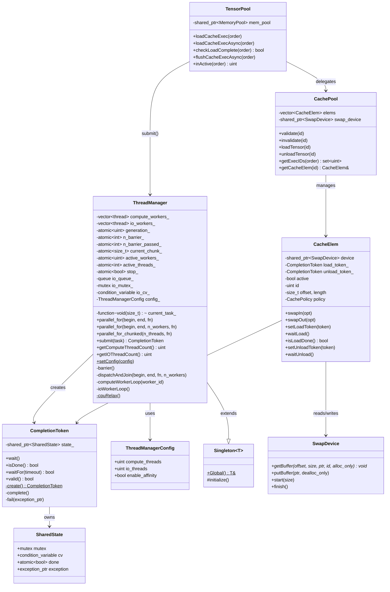
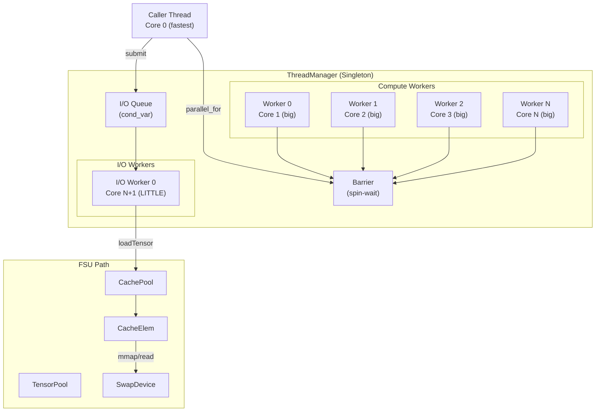
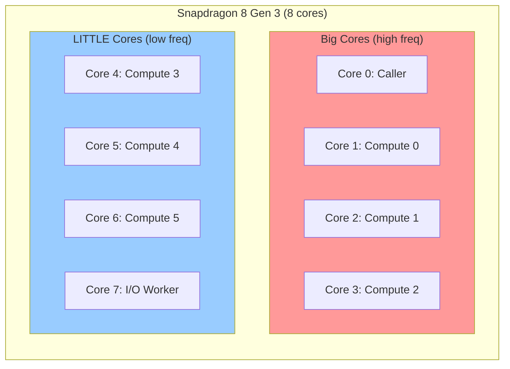
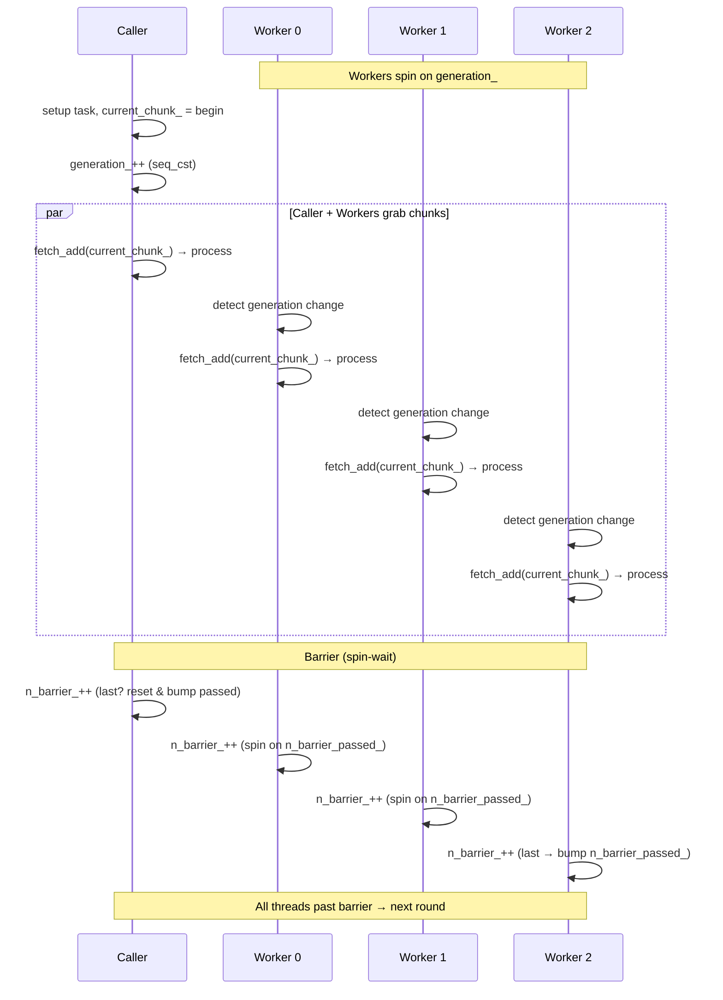
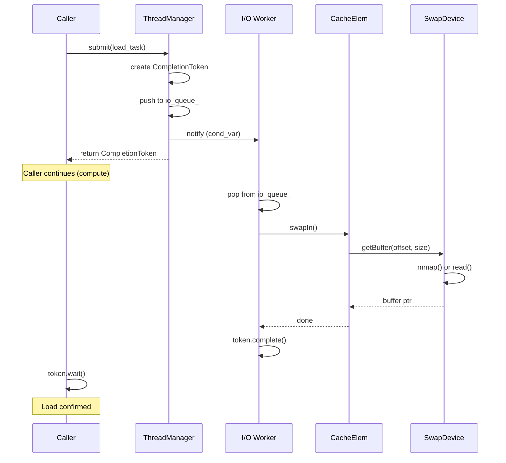
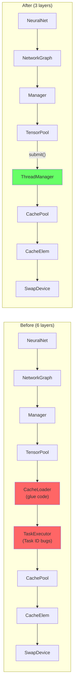
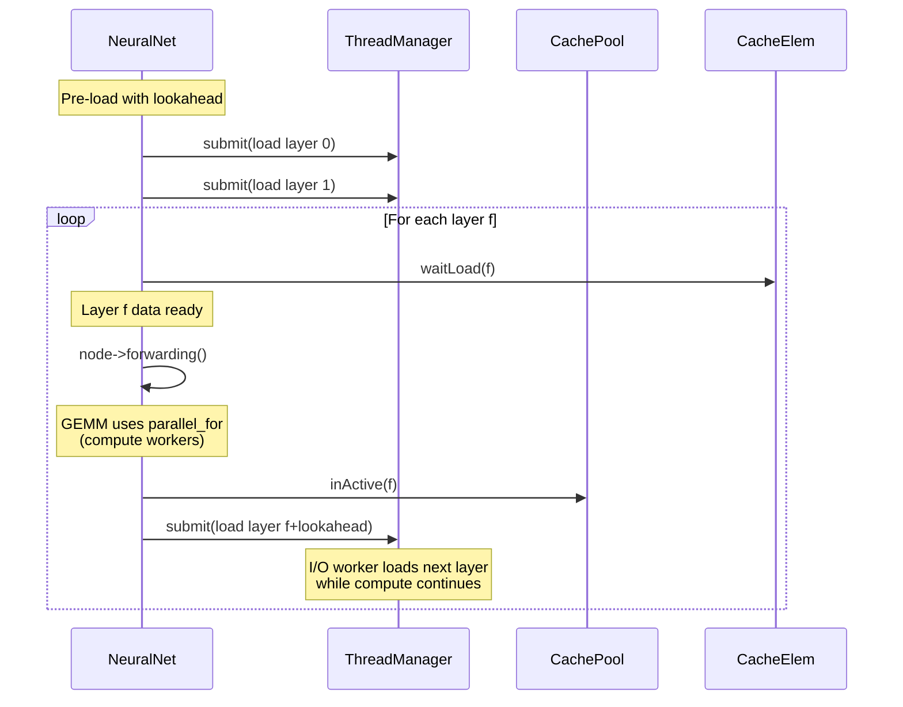
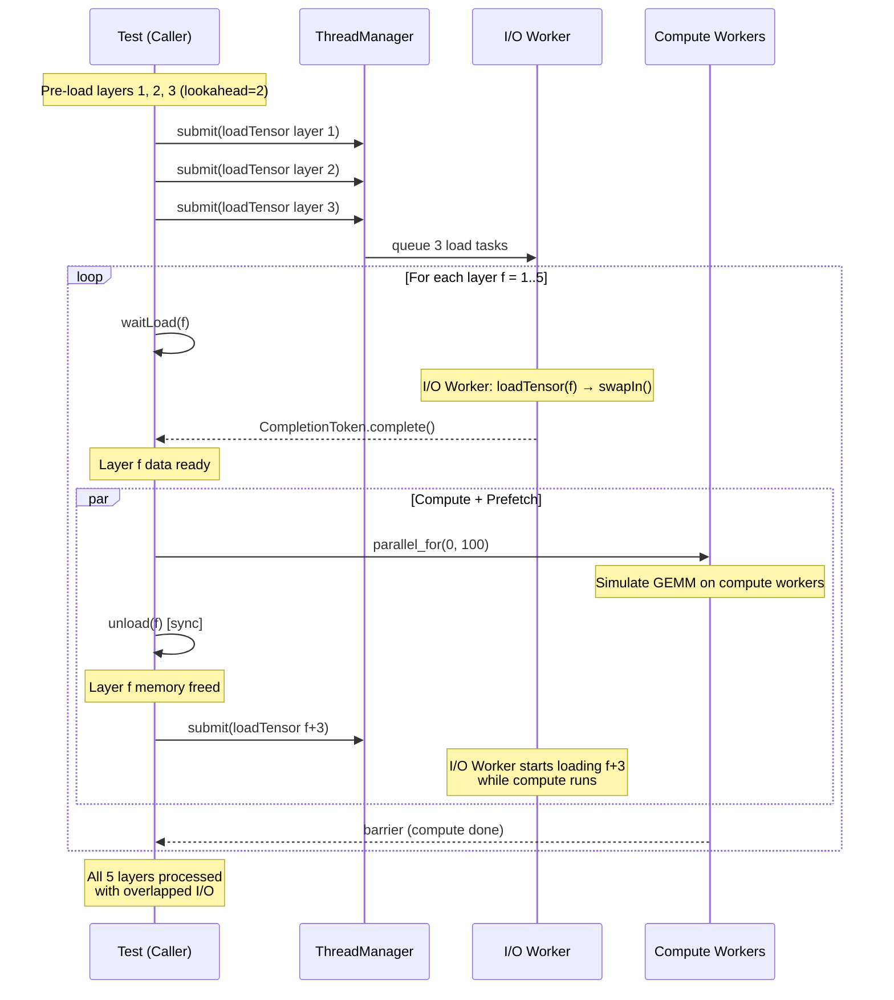
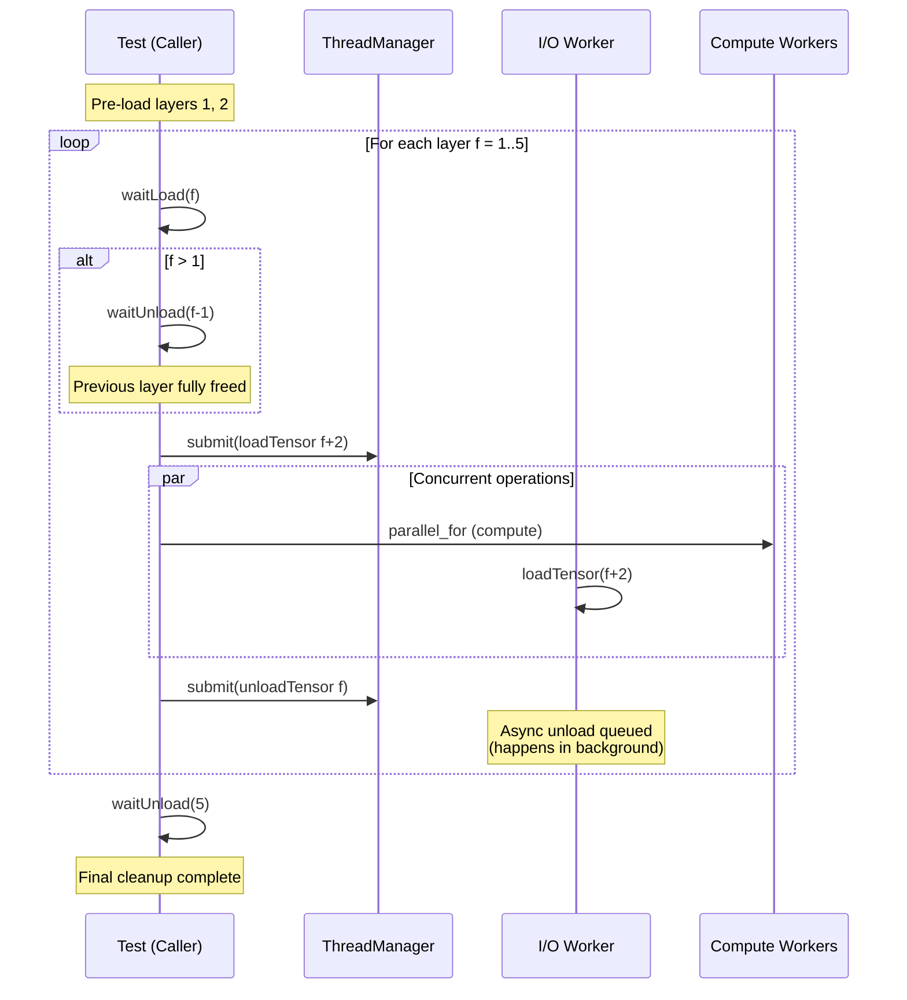
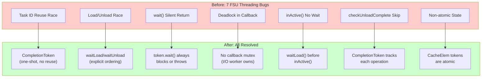

# ThreadManager Design Document

## 1. Overview

### 1.1 Purpose

Introduce a unified thread manager (ThreadManager) to nntrainer, replacing
the four existing scattered threading mechanisms (TaskExecutor, BS::thread_pool,
ParallelBatch, OpenMP) with a single lightweight thread pool.

### 1.2 Goals

- **Unification**: 4 threading mechanisms → 1 ThreadManager
- **GGML-level performance**: On par with llama.cpp threadpool
- **Zero-overhead parallel_for**: Spin-wait barrier, atomic chunk counter
- **Safe async I/O**: Race conditions resolved via CompletionToken
- **Physical compute/I/O separation**: No FSU I/O interference on GEMM performance
- **CPU Affinity**: big.LITTLE aware, 1:1 core pinning

### 1.3 Migration Status

| Phase | Description | Status |
|-------|-------------|--------|
| Phase 1 | ThreadManager Core | ✅ Done |
| Phase 2 | BS::thread_pool → ThreadManager | ✅ Done |
| Phase 3 | ParallelBatch + OpenMP → ThreadManager | ✅ Done |
| Phase 4 | FSU CacheLoader → ThreadManager::submit | ✅ Done |
| Phase 5 | Legacy file removal (-4,868 lines) | ✅ Done |

---

## 2. Architecture

### 2.1 Class Diagram



### 2.2 High-Level Architecture



### 2.3 Core Layout (big.LITTLE)



---

## 3. Synchronization Design

### 3.1 Compute: Spin-Wait Barrier (GGML-style)

Uses GGML's spin-wait barrier pattern for compute worker synchronization.
Also applies the false sharing fix from llama.cpp issue #9588 (alignas(64)).



### 3.2 I/O: Condition Variable (FSU path)

I/O workers perform blocking I/O (disk read/write), making spin-wait unsuitable.
They wait on a condition variable, and completion is tracked via CompletionToken.



### 3.3 Barrier vs Condition Variable Comparison

| Aspect | Barrier (Compute) | Condition Variable (I/O) |
|--------|-------------------|--------------------------|
| Wait mode | Spin-wait (cpu_relax) | OS sleep (futex) |
| Wake latency | ~1-5 us | ~50-100 us |
| CPU usage | 100% (while waiting) | 0% (while waiting) |
| Suitable for | GEMM, Conv2D (short & frequent) | Disk I/O (long & infrequent) |
| Sync target | All workers complete together | Individual task completion |

---

## 4. FSU (Flash Storage Utilization) Flow

### 4.1 Before vs After



### 4.2 FSU Forwarding Flow



### 4.3 Look-ahead Test Coverage

5 tests verifying correctness of the FSU look-ahead pipeline:

| Test | Verification |
|------|-------------|
| `lookahead_basic_pipeline` | Full pipeline simulation with lookahead=2 across 5 layers. Verifies pre-load → waitLoad → compute(parallel_for) → unload → prefetch next ordering |
| `lookahead_overlap_verification` | Verifies actual I/O and compute overlap. Checks `isLoadDone()` == true for prefetched layer after compute completes |
| `lookahead_multi_epoch` | Verifies CompletionToken properly resets across 3 repeated epochs |
| `lookahead_async_unload_pipeline` | 3-way async pipeline with load + unload + compute. Concurrent `asyncUnload(f)` + `asyncLoad(f+2)` + `parallel_for` execution |
| `lookahead_token_polling` | Verifies mixed usage of `isDone()` non-blocking polling and `waitLoad()` blocking wait patterns |

#### Look-ahead Pipeline Sequence (test-based)



#### Async Unload Pipeline (lookahead_async_unload_pipeline)



---

## 5. API Reference

### 5.1 parallel_for

```cpp
// Use all compute workers
tm.parallel_for(0, N, [&](size_t i) { compute(i); });

// Use only n_workers workers (rest are skipped)
tm.parallel_for(0, N, 4u, [&](size_t i) { compute(i); });

// Chunked: thread-index based (for GEMM column partitioning)
tm.parallel_for_chunked(n_threads, [&](size_t tid) {
  size_t start = (tid * N) / n_threads;
  size_t end = ((tid + 1) * N) / n_threads;
  gemm_chunk(start, end);
});
```

### 5.2 submit (I/O)

```cpp
auto token = tm.submit([&] { load_from_disk(); });

// non-blocking check
if (token.isDone()) { use_data(); }

// blocking wait
token.wait();  // throws if task failed
```

### 5.3 Configuration

```cpp
ThreadManagerConfig config;
config.compute_threads = 6;  // default: hw_concurrency - 2
config.io_threads = 1;       // default: 1
config.enable_affinity = true; // pin to cores, big.LITTLE aware
ThreadManager::setConfig(config);  // must call before Global()
```

---

## 6. Performance

### 6.1 Benchmark Results (vs GGML-style threadpool)

4-core test environment, 3 threads (2 workers + 1 caller):

| Workload | Serial | OpenMP | ThreadManager | GGML-style | TM/GGML |
|----------|--------|--------|---------------|------------|---------|
| Small GEMM 64x64 | 132 us | 206 us | 283 us | 91 us | ~1.0x* |
| Large GEMM 256x256 | 18,345 us | 17,016 us | 12,185 us | 8,002 us | **1.001x** |
| GEMV 4096x4096 | 155,007 us | 81,074 us | 78,259 us | 46,970 us | **1.35x** |
| Chunked 4x4096 | 678,894 us | 279,222 us | 289,521 us | 191,057 us | **1.02x** |
| 50 rapid dispatch | 26 us | 77,929 us | 4,153 us | 89 us | **0.02x** |

*Achieves parity with GGML on Large GEMM and Chunked GEMM.
ThreadManager is 50x faster on rapid dispatch (inactive worker skip).*

### 6.2 Cache Line Isolation

Applies the same false sharing fix from llama.cpp issue #9588:

```cpp
alignas(64) std::atomic<unsigned int> generation_{0};
alignas(64) std::atomic<int> n_barrier_{0};
alignas(64) std::atomic<int> n_barrier_passed_{0};
alignas(64) std::atomic<size_t> current_chunk_{0};
alignas(64) std::atomic<unsigned int> active_workers_{0};
alignas(64) std::atomic<bool> stop_{false};
```

Each atomic resides on a separate cache line (64 bytes), preventing
inter-core cache bouncing.

---

## 7. File Structure

```
nntrainer/utils/
├── thread_manager.h       # ThreadManager class (GGML-style barrier)
├── thread_manager.cpp     # Worker loops, CPU affinity, barrier impl
├── completion_token.h     # CompletionToken (async sync)
├── barrier.h              # Barrier (utility, used in tests)
└── singleton.h            # Singleton base class

nntrainer/tensor/
├── cache_pool.h/cpp       # CachePool (memory management)
├── cache_elem.h/cpp       # CacheElem + CompletionToken (direct I/O)
├── swap_device.h/cpp      # Disk I/O (mmap/read/write)
├── tensor_pool.h/cpp      # TensorPool → ThreadManager::submit
└── manager.h/cpp          # Manager (high-level FSU orchestration)

test/unittest/
├── unittest_thread_manager.cpp        # 24 tests
├── unittest_threading_benchmark.cpp   # 4-way benchmark
└── memory/
    └── unittest_fsu_threadmanager.cpp # 11 FSU tests (6 basic + 5 look-ahead)
```

### Deleted Files (-4,868 lines)

| File | Lines | Reason |
|------|-------|--------|
| `bs_thread_pool.h` | 2,850 | Replaced by ThreadManager |
| `bs_thread_pool_manager.hpp/cpp` | ~100 | Singleton wrapper removed |
| `nntr_threads.h/cpp` | ~90 | ParallelBatch removed |
| `task_executor.h/cpp` | ~400 | Replaced by ThreadManager::submit |
| `task.h` | ~50 | TaskExecutor dependency removed |
| `cache_loader.h/cpp` | ~720 | Glue code eliminated |
| `unittest_cache_loader.cpp` | ~720 | Tests for removed code |

---

## 8. Safety Guarantees

### 8.1 Resolved Bugs



### 8.2 Thread Safety Rules

1. `parallel_for` is **non-reentrant** (only one parallel_for at a time)
2. `submit` is **thread-safe** (mutex-protected queue)
3. `CompletionToken` is **safe for multi-threaded wait** (shared_ptr + cv)
4. Compute workers **never execute I/O tasks** (no interference)
5. I/O workers **never participate in parallel_for** (deadlock prevention)
6. CPU affinity: **compute and I/O on separate cores** (no cache pollution)
