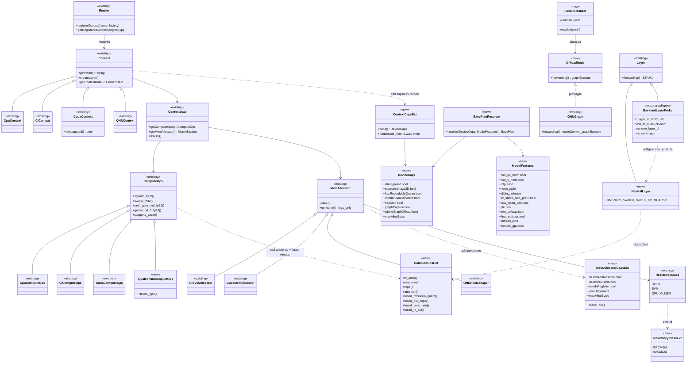
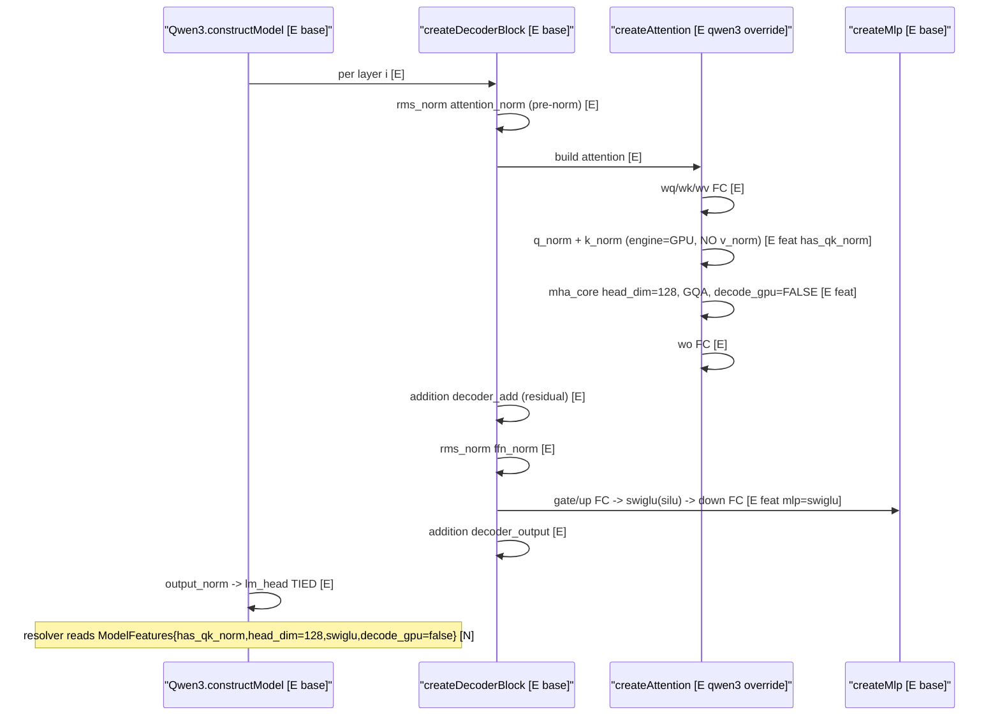
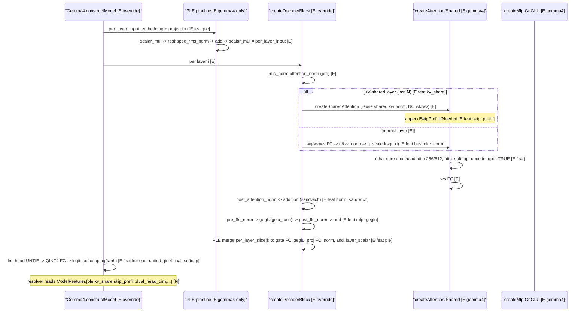
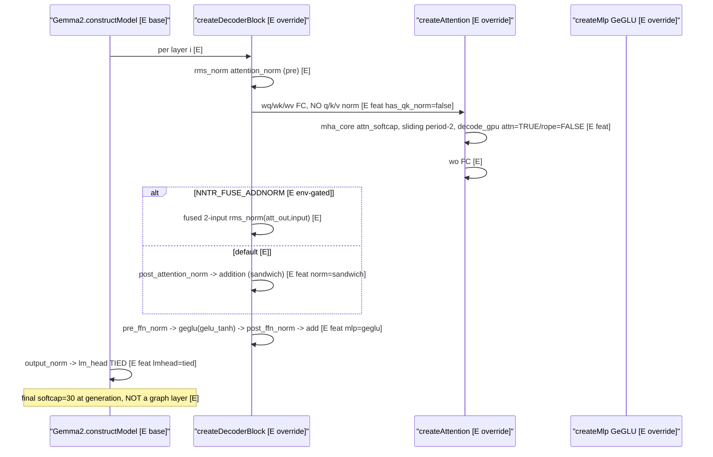
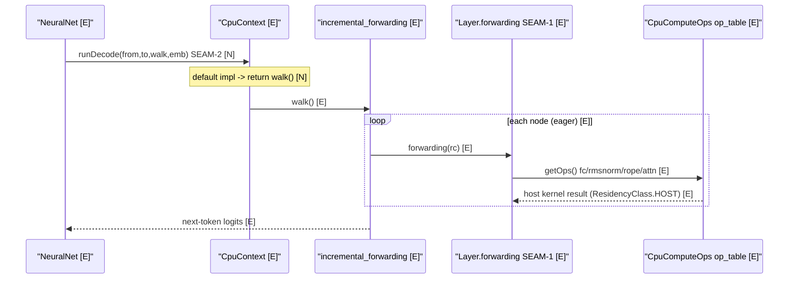
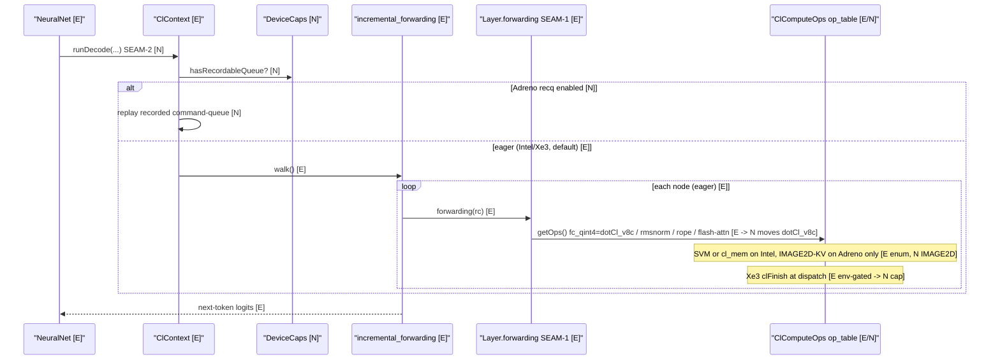
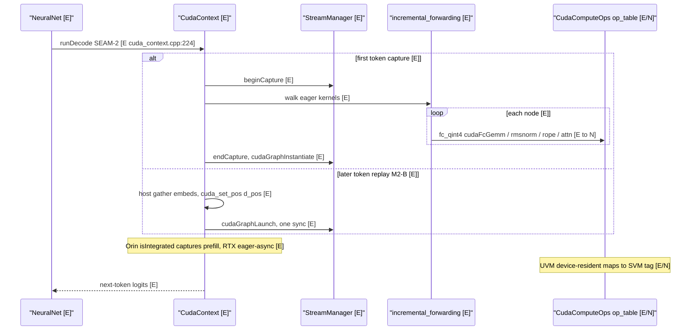
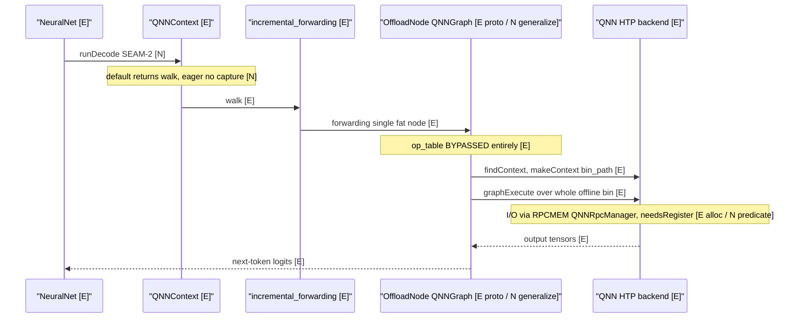
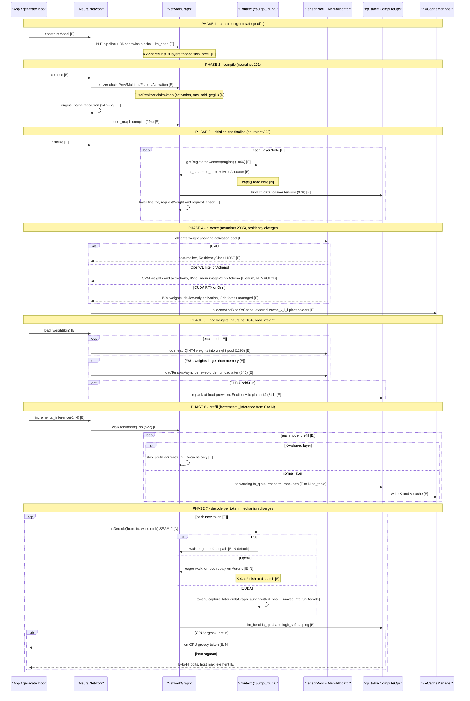
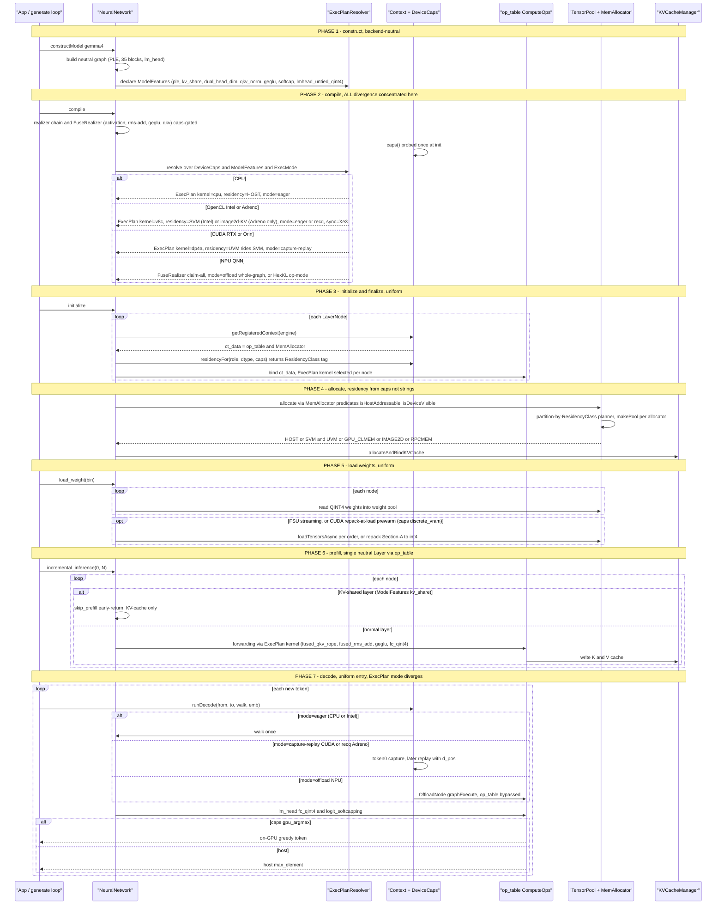

# nntrainer Multi-HW Backend Refactor — Architecture

> **Status: PARTIALLY IMPLEMENTED (banner updated 2026-07-02; content last touched 2026-07-13;
> more has landed since — HTP/HexKL Phase-0 skeleton, CLBlast retirement, the OpenCL SVM
> read-back hazard fix — see the 2026-07 field-decisions addendum at the bottom).** The design
> below has landed in code in large part; this section now tracks *what is built vs. still to-add*
> (§10 task IDs). **Anchor-drift caveat:** the `file:line` anchors throughout this doc have not
> all been re-verified since 2026-07-02 and are known to drift (observed 2-183 lines in places);
> treat every anchor as approximate and confirm against the current tree, not as ground truth.
> Prefer `file: symbol` over `file:line` when adding new anchors, so a `grep` relocates them after a
> drift. **Operational companion:** `docs/GPU_CONTRIBUTION_CHECKLIST.md` turns the normative rules
> below into a per-PR checklist with runnable `grep` verifications — it is derived from this document
> and must be updated whenever this one changes.
> **Implemented [E]:** T1 `DeviceCaps`+`Context::caps()` (`context.h:63,429`); T2 `MemAllocator`
> capability predicates (`mem_allocator.h:89-151`, wired `memory_pool.cpp:256`); T6
> `CudaComputeOps : CpuComputeOps` + `get_cuda_ops()` bound (`cuda_compute_ops.cpp:48`,
> `cuda_context.cpp:79`); T9 `Context::runDecode` SEAM-2 (`context.h:471`, base `neuralnet.cpp:618`,
> CUDA override `cuda_context.cpp:224`); T13 `engine=npu`→QNN alias (`engine.cpp:93`); T10
> `FusionRealizer` (`compiler/fusion_realizer.cpp`) — env-gated `NNTR_FUSE_ACT` + **inference-gated**
> (`neuralnet.cpp:232`, commit `bfc0f2f0b`, after a training-gradient bug); **T3 registration facade (= §11 S1)** —
> `virtual Context::registerLayerFactory` (`context.h:461`) + `Engine::registerLayerFactory` shim
> (`engine.h:191`) + backend overrides (`app_context.cpp:757`, `cl_context.cpp:693`,
> `cuda_context.cpp:304`), commit `d5dce6c4b`; a tree-wide `static_cast<*Context*>->registerFactory`
> grep returns **zero** hits (re-verified 2026-07-28). **Partial:** T3 registry
> open — engine-level done (`engine.cpp:113` validates the live registered-name set); layer-level
> residency mapping (`layer_node.cpp:143` toLayerComputeEngine) now reads each context's
> `Context::residencyEngine()` declaration instead of string-matching the closed EnumStr table (which
> is demoted to an unregistered-name fallback) — the `LayerComputeEngine` enum itself
> (`common.h:49`) stays closed at cpu/gpu/qnn/cuda for the residency plane; T7 op_table —
> fc/geglu/swiglu absorbed,
> but attention/rmsnorm/rope still bypass. **Shadow / inert:** T4 `ExecPlan` resolver + T11
> `ModelFeatures` are SHADOW (resolved+logged, not authoritative; `context.h:146,208,255`); T5
> `TensorRole` threaded but inert. **Not started:** T8 (flip resolver authoritative), T14 (QNN
> `OffloadNode`). Anchors below are being updated to match the tree.
> Every node/step is tagged **[E]** existing in tree, **[N]** to-add, **[E→collapse]**
> exists but folds away. Anchors are `file:line` against the current tree.

---

## 1. Purpose & scope

One model definition must run on **CPU (incl. training) / OpenCL (Intel Xe, Adreno) /
CUDA (RTX, Orin) / NPU (QNN/HTP, future S.LSI Exynos)** and a new HW must be **add-only**
(new files, no edits to model/core/other-backend). The goal is *not* a new framework —
it is to **finish the `Context / ContextData / op_table / Layer / Tensor` spine you already
built** so backend differences are expressed only as (a) an `op_table` virtual, (b) a
`Context` capability/policy method, or (c) a `MemAllocator` property — and **nobody names a
backend except the registry**.

### The add-only invariant has TWO halves — quote the one you mean

The sentence above states the *backend* half only. It is routinely quoted as if it governed any new
GPU feature, which it does not; the day-to-day case (adding a layer's GPU path to an **existing**
backend) is governed by the second half, which used to be inferrable only from §4's COLLAPSE rule and
§9 T7. Both are normative:

- **(1a) Backend add-only.** Adding a new HW — a new `Context` / `ComputeOps` / `MemAllocator` triad —
  requires **zero edits** to existing model `.cpp` files, to another backend's files, or to the
  `network_graph.cpp` / `layer_node.cpp` spine. §8 is the worked example; §8 step 1's closed-enum edit
  is the single documented exception, and only for a HW that needs its own residency plane.
- **(1b) Layer add-only.** Adding GPU support for an **existing** op on an **existing** backend
  requires **zero new Layer subclasses**. It is expressed as a new or extended `ComputeOps` whole-op
  virtual, dispatched from the **same** Layer class that already runs on CPU (§9 Decision #2 = A).
  A new `XLayerCl` + `CudaXLayer` pair registering one type string as two classes is a violation of
  this half — see §4's collapse rule, and the §9 BACKLOG note for the interim rule that applies while
  the `rmsnorm` whole-op virtual is still absent.

Two property vocabularies meet at one matcher → **O(N+M), not O(N×M)**:
`ModelFeatures` (what the model is) × `DeviceCaps` (what the HW can do) → `ExecPlan`.

---

## 2. The layered architecture

```
L5  MODEL            single-source neutral graph + ModelFeatures (names NO backend)
L4  RESOLVER         resolve(DeviceCaps × ModelFeatures × ExecMode) → ExecPlan        [N]
L3a OP_TABLE         ComputeOps whole-op virtuals (incl. fused)                       [E base / N completion]
L3b EXEC-ENGINE      SEAM-1 Layer.forwarding (op-node | OffloadNode) [E] + SEAM-2 runDecode [N]
L2  DEVICECAPS       Context::caps()  — what CAN this HW do                           [N]
L1  CONTEXT          link-time self-registration (dlopen for QNN)                     [E spine / N caps]
L0  HW PROBES        cudaGetDeviceProperties / clGetDeviceInfo                        [E]
```

**The one rule:** capability flows **up** (L0→L2), decisions flow **down** (L4→L3). No layer
calls up. The resolver (L4) is a **pure function** — shadow-runnable and unit-testable against
every HW baseline before it is authoritative.

---

## 3. Class diagram (existing vs to-add)



> **Diagram vs. decisions.** This diagram predates §9's decisions; where they disagree, **§9 wins**.
> One element has been struck accordingly: `ContextCapsExt::residencyFor(role)` was drawn here in the
> original synthesis and is **REJECTED by §9 Decision #4** — `MemAllocator` capability predicates
> (`isHostAddressable`/`isDeviceVisible`/`isSVM`/`needsRegister`) own residency, and no
> `Context::residencyFor` method exists or should be added (`grep -rn residencyFor` over the tree
> returns zero, verified 2026-07-28). Any other §3 element superseded by a §9 decision should get the
> same inline strike rather than relying on the reader reaching §9.

### Legend (existing vs to-add)

| Class | Status | Note |
|---|---|---|
| Engine, Context(+subclasses), ContextData | **[E]** | spine works; `getName()` returns cpu/gpu/cuda/qnn/htp |
| ComputeOps (+Cpu/Cl/Cuda), get_*_ops singletons | **[E]** | whole-op virtuals incl. `swiglu_fp32`/`tanh_gelu_mul_fp32`/`gemm_q4_*` exist (`compute_ops.h:109/116/154`) **but hot kernels bypass it** |
| MemAllocator (+ClSVM/Cuda/QNNRpc) | **[E]** | capability predicates LANDED (`mem_allocator.h:89-151`: `isHostAddressable`/`isDeviceVisible`/`isSVM`/`needsRegister`); residency now derives from `isSVM()` (`memory_pool.cpp:256`), not `getName()` (T2 done) |
| ResidencyClass {HOST,SVM,GPU_CLMEM} | **[E]** | `memory_data.h:38`, OpenCL-shaped/closed |
| QNNGraph (fat-node) | **[E]** | `QNNGraph.cpp:196` = makeContext+graphExecute over offline `.bin` |
| CUDA-graph capture/replay | **[E]** | **MOVED** into `CudaContext::runDecode` (`cuda_context.cpp:224`+); still the per-step re-instantiate *prototype/ceiling harness* (comment "purely to prove" `cuda_context.cpp:233`); `neuralnet.cpp:618` now holds only the base no-op walk (`incremental_forwarding`) |
| BackendLayerForks (cl_layers/cuda_layers/`*_gpu`) | **[E→collapse]** | fold into NeutralLayer + op_table |
| DeviceCaps, `Context::caps()`, `Context::runDecode()` | **[E]** | LANDED: struct `context.h:63`, `caps()` `context.h:429`, `runDecode()` `context.h:471` + base `neuralnet.cpp:618` + CUDA override `cuda_context.cpp:224`; **`residencyFor` absent BY DESIGN** — rejected by Decision #4, not pending work |
| ComputeOpsExt (fc_qint4/rmsnorm/rope/attention/fused_*) | **[N]** | absorbs `dotCl_v8c`+`cudaFcGemm` |
| QualcommComputeOps (HexKL/HTP) | **[E Phase-0 skeleton]** | Mode-2 op-by-op NPU: **LANDED**, not [N] as previously tracked — `HtpContext` (`htp_context.h`, `getName()=="htp"`) + `HtpComputeOps : CpuComputeOps` overriding `shgemm`/`shgemm_u8i8`/`shgemm_u8i4` with `supports_*()` predicates (`htp_backend/htp_compute_ops.cpp:32`), registered in `engine.cpp` under `#if ENABLE_HEXKL`, meson `enable-htp` default false. The first REAL worked instance of the add-only pattern (§8's Exynos walkthrough is hypothetical). Production/perf validation still pending. |
| MemAllocatorCapsExt, ResidencyClassExt (RPCMEM/IMAGE2D) | **[E]** | predicates landed (`mem_allocator.h:89-151`); RPCMEM/IMAGE2D enum values reserved (`memory_data.h:47-48`) with consumers pending (M4-M7). ~~UVM rides SVM tag~~ **2026-07-09 field-corrected: UVM must NOT ride the SVM tag** — every isSVM() consumer is an OpenCL kernel-binding gate, and the unified build hijacked CUDA tensors through it (deterministic whole-model garbage on Windows; see the isSVM() CONTRACT in `mem_allocator.h` and `CudaMemAllocator::isSVM()==false`). A DEVICE residency class (cudaMalloc, host-unreachable) is now implicit via `isHostAddressable()==false` — promote to `ResidencyClass::DEVICE` in M6 |
| ExecPlan resolver, ModelFeatures | **[E shadow]** | landed as free fns + structs (`context.h:146,170,208,255`); resolved+logged only, zero authoritative consumers (flip = T8). ModelFeatures replaces the `is_gemma2` proxy |
| FusionRealizer **[E]**; OffloadNode, NeutralLayer **[N]** | mixed | FusionRealizer landed (`compiler/fusion_realizer.cpp`, inference- + CPU-engine-gated); OffloadNode/NeutralLayer absent |

> ✅ **CudaContext→CudaComputeOps DONE (T6).** `cuda_context.cpp:79` now binds `get_cuda_ops()`
> (not `get_cpu_ops()`); `CudaComputeOps : public CpuComputeOps` exists (`cuda_compute_ops.cpp:48`,
> `get_cuda_ops()` singleton `:291`), so unported ops fall through to the CPU path on host-coherent
> UVM pointers rather than throwing.

---

## 4. CausalLM custom-layer promotion (→ official core)

CausalLM has ~22 custom layers under `Applications/CausalLM/layers/`. Official `nntrainer/layers/`
has `attention_layer`, `multi_head_attention_layer`, `mol_attention_layer`, `embedding`,
`layer_normalization` — but **no RMSNorm / SwiGLU / GeGLU / LLM-MHA / RoPE**.

| Custom layer | Verdict | Target |
|---|---|---|
| `RMSNormLayer` (rms_norm.h) | **PROMOTE** | new core `rms_norm_layer` |
| `rms_norm_gpu.h` | **COLLAPSE** → op_table | `ComputeOpsExt::rmsnorm` |
| `ReshapedRMSNormLayer` (reshaped_rms_norm.h) | **PROMOTE** | core RMSNorm + reshape/feature_size param (per-head q/k/v norm) |
| `rms_reverse_norm.h` | **KEEP** | specialized |
| `SwiGLULayer` (swiglu.h) | **PROMOTE** | core SwiGLU; CPU `swiglu_fp32` already exists |
| `GeGLU` (cl_layers/geglu_cl) | **COLLAPSE + PROMOTE** | core GeGLU + op_table; CPU `tanh_gelu_mul_fp32` exists |
| `MHACoreLayer` (mha_core.h) | **PROMOTE** | new core `llm_mha` (GQA + RoPE + sliding + softcap + gpu_decode) — distinct from official MHA |
| `QKVLayer/QUnit` (qkv_layer.h) | **PROMOTE** | core fused QKV projection |
| `EmbeddingLayer` (embedding_layer.h) | **PROMOTE/MERGE** | reconcile with official `embedding` (scale param) |
| `embedding_normalize_layer.h`, `embedding_pooling_layer.h` | **KEEP** | app-specific |
| `LmHeadLayer` (lm_head.h) | **PROMOTE** | core lm_head (tie/untie + QINT4) |
| `LogitSoftCappingLayer` (logit_softcapping.h) | **PROMOTE** | core logit-softcap activation (gemma) |
| `PerLayerSliceLayer` (per_layer_slice.h) | **KEEP** | model-specific (gemma4 PLE) |
| `per_layer_slice_gpu.h` | **COLLAPSE** → op_table | |
| `ScalarMultiplyLayer` (scalar_multiply.h) | **PROMOTE** | core scalar_multiply (general elementwise) |
| `scalar_multiply_gpu.h` | **COLLAPSE** → op_table | `ele_mul`/scalar path |
| `shared_fully_connected_layer.h` | **PROMOTE** | core FC w/ shared-weight binding |
| `tie_word_embedding.h` | **PROMOTE** | core tied-embedding (shared_from) |
| `deberta_attention_layer.h` | **KEEP** | model-specific |

**Rule:** every `*_gpu` / `cl_layers/` / `cuda_layers/` fork **COLLAPSES** into one neutral layer
that dispatches through `ComputeOpsExt`. **PROMOTE** = becomes an official `nntrainer/layers/`
layer (reusable by non-LLM graphs too). **KEEP** = stays CausalLM-specific.

---

## 5. Per-model construction — qwen3 / gemma4 / gemma2

Every model derives `Transformer → {Model}Transformer → {Model}CausalLM` and builds the graph
declaratively (`createLayer(type, props)`, no eager forward at build). The graph is single-source:
each layer carries `engine = causallm_engine()`, so the **same graph** resolves to cpu/gpu/cuda at
finalize. The per-model divergence lives in `createAttention / createMlp /
createTransformerDecoderBlock / constructModel` overrides — **this is exactly the data the to-add
`ModelFeatures` struct encodes** (today it is hardcoded + an `is_gemma2` proxy).

### ModelFeatures table (the resolver inputs)

| Feature | qwen3 | gemma4 | gemma2 |
|---|---|---|---|
| q/k-norm | ✅ reshaped_rms_norm (GPU-resident) | ✅ q/k/v-norm | ❌ |
| v-norm | ❌ | ✅ (use_gamma=false) | ❌ |
| head_dim | **128** | **dual 256/512** (sliding/global) | DIM/n_heads |
| MLP | **SwiGLU** (silu) | **GeGLU** (gelu_tanh) | **GeGLU** |
| norm style | pre-norm | **sandwich** | **sandwich** (opt. `NNTR_FUSE_ADDNORM`) |
| sliding window | base | dual | **alternating period-2** |
| KV-share + skip-prefill | ❌ | ✅ last N layers | ❌ |
| PLE (per-layer embed) | ❌ | ✅ | ❌ |
| attn softcap | ❌ | ✅ | ✅ |
| final logit softcap | ❌ | ✅ (graph layer) | at generation (not a layer) |
| lm_head | tied | **untie-able QINT4** | tied |
| decode-GPU (attn/rope) | OFF (d=128 diverges) | **ON** | attn ON / rope OFF |

### qwen3 — q/k-norm, head_dim=128, SwiGLU, decode-GPU OFF



### gemma4 — PLE + KV-share/skip-prefill + dual head_dim + q/k/v-norm + GeGLU + softcap



### gemma2 — sandwich-norm, GeGLU, attn softcap, alternating sliding, NO q/k-norm, tied



---

## 6. Per-HW execution — CPU / CL / CUDA / QNN

Same compiled neutral graph, one decode step (`incremental_forwarding`), after finalize bound each
node's `ct_data->getComputeOps()` op_table + `MemAllocator`. **The divergence to watch:**
**CPU = eager op_table (no decode hook)**, **CL = eager + optional recordable-queue replay**,
**CUDA = eager kernels CAPTURED into one CUDA-graph then replayed**, **QNN = whole-graph offload,
op_table BYPASSED** (graphExecute over an offline `.bin`).

### Lifecycle-stage × HW divergence

| Stage | CPU | CL (Intel/Adreno) | CUDA (RTX/Orin) | QNN (Qualcomm HTP) |
|---|---|---|---|---|
| **compile** `:201`/`:216-225` [E]; **FusionRealizer claim-knob [N]** | per-op graph | per-op graph | per-op graph | **claim-all → ONE OffloadNode** (only stage that changes node count) [E proto / N realizer] |
| **engine/pool** `:247-279` [E] | host-malloc pool (default `MemAllocator`) | `GPU_SVM_POOL`→ClSVMAllocator | `CUDA_UVM_POOL`→CudaMemAllocator | RPCMEM pool (QNNRpcManager) |
| **finalize** `network_graph.cpp:1096` [E] | CpuComputeOps | ClComputeOps; **dotCl_v8c→fc_qint4, collapse cl_layers** [E/N] | CudaComputeOps; **cudaFcGemm→fc_qint4, collapse cuda_layers** [E/N] | op_table **BYPASSED** — OffloadNode binds `.bin` |
| **allocate** `:2035` [E] | HOST | **Intel** = SVM + cl_mem buffer (`V8C_BUF`); **IMAGE2D-KV = Adreno only** (`read_imageui` won't compile on Intel NEO) [E / N IMAGE2D tag] | UVM device-resident → SVM tag [E/N] | **RPCMEM, needsRegister** [E alloc / N predicate] |
| **run/decode** SEAM-2 `runDecode` [E hook] | **default walk()** | eager **or** recq replay (Adreno); Xe3 clFinish [E hook / E recq+xe3] | **CUDA-graph capture+replay** in `cuda_context.cpp:224` [E hook / E logic] | **eager** (no capture) |
| **decode (1-line)** | eager, no hook | eager + opt recq | eager → whole-graph **CAPTURE/replay** | whole-graph **OFFLOAD** |

### CPU — eager op-by-op, no decode hook



### CL (Intel / Adreno) — eager op_table, optional recordable-queue replay



### CUDA (RTX / Orin) — eager kernels CAPTURED into one CUDA-graph, replayed



> ⚠ The CUDA-graph block has been **MOVED** behind `CudaContext::runDecode` (`cuda_context.cpp:224`+);
> it is still the **prototype/ceiling harness** (re-instantiates per step, comment "purely to prove"
> `cuda_context.cpp:233`). Remaining work: turn it into a real single-capture replay. `neuralnet.cpp`
> now holds only the base no-op `runDecode` walk (`neuralnet.cpp:618`).

### QNN (Qualcomm HTP) — whole-graph OffloadNode, op_table BYPASSED



### gemma4 end-to-end (detailed) — construct → compile → load → forward, on CPU / OpenCL / CUDA

The full lifecycle for **gemma4** (PLE + 35 sandwich blocks + KV-share/skip-prefill + untied-QINT4
lm_head + final softcap). Shared spine, with the **backend-divergent** steps in `alt CPU / OpenCL /
CUDA` blocks (residency at allocate, repack at load, mechanism at decode, argmax). `[E]`=exists,
`[N]`=to-add.



### gemma4 end-to-end — TARGET (post-refactor) structure

The same lifecycle **after the refactor is complete**. The key structural change vs the diagram above:
**backend divergence is concentrated at PHASE 2 (the `ExecPlanResolver`), and execution is uniform** —
`ModelFeatures × DeviceCaps → ExecPlan` decides kernel/residency/sync/mode *once*; PHASES 3–7 then run
one neutral graph parametrized by that `ExecPlan` (no `*_cl/*_cuda` forks, no scattered env branches).



---

## 7. Fusion catalog

Fusion is the **one optimization that crosses to CPU** (it is a memory-hierarchy *locality* win —
CPU cache, GPU register/LDS/SVM, NPU TCM). Residency / capture-replay / offload are accelerator-only.
**Three-way split:** *transformation* = backend-neutral `FusionRealizer` (sibling of `bn_realizer`);
*profitability* = caps-gated (fuse only when it avoids a slow-memory round-trip); *kernel* =
`op_table` fused virtual, `supports_fused_X()` gated, unfused fallback.

| Category | Examples | Applies to | Existing infra | Priority |
|---|---|---|---|---|
| **🆕 Activation / epilogue** | `conv+relu`, `conv+bn+relu`, `fc+gelu`, `matmul+bias+act` (GEMM/conv epilogue) | **CNN + training + inference, ALL backends** (most general) | `ActivationRealizer` (`neuralnet.cpp:222`), `bn_realizer` (BN fold) **exist** | **🥇 broadest reach** |
| Gated-MLP | `swiglu` (gate·silu·up), `geglu+quant` | LLM | op_table `swiglu_fp32`/`tanh_gelu_mul_fp32`; `fused_rmsnorm_quant.cl` | 🥈 (op_table virtual already on CPU+CL) |
| Norm | `rms+add` (residual), `conv+bn` | LLM/CNN | CL committed (`094fe752`, Intel +4%) | 🥉 |
| Projection | `qkv+rope` | LLM | `fused_qkv_rope.cl` | 4 |
| **(kernel-internal — NOT a FusionRealizer target)** | `dequant+matmul` | all | GGML q4_0/q6_k, v8c int4 FC, `cuda_fc_qint4` | — (lives inside the GEMM kernel) |

**Activation fusion has two forms** (both go in the doc): *in-place activation* (operate on the conv
output buffer — only saves a buffer, low value) vs **epilogue fusion** (compute the activation
*inside* the conv/GEMM kernel before writing — never materializes the pre-activation = the real win),
implemented as a fused `conv_relu`/`fc_act` op_table virtual *or* an activation-epilogue param on the
conv/GEMM kernel. Activation fusion is the **easiest first** FusionRealizer (the `ActivationRealizer`
seam already exists) and is the only category that benefits the **training / CNN** path, not just LLM.

---

## 8. Adding a new HW — worked example: S.LSI Exynos NPU

Exynos uses its **own SDK** (Exynos Neural Network / ENN), not QNN — the generality test. Goal: light
it up without touching CPU/CL/CUDA hot paths or any model `.cpp`.

> **Credibility grading (added 2026-07-28).** The steps are written in the imperative as if they were
> validated procedure; they are not uniformly so. The HTP/HexKL Phase-0 landing is the one real
> instance of this walkthrough, so each step below is tagged with what it actually proved. An author
> following an `[unproven]` step is prototyping, not repeating a known-good recipe.

1. **Open the closed enum [edit existing — the ONLY unavoidable shared edit until the *layer-level*
   registry is opened].** `[unproven, and conditionally unnecessary]` — the HTP landing added a
   `"htp"` context with **no** enum edit: `LayerComputeEngine` is still `{CPU,GPU,QNN,CUDA}`
   (`common.h:49`) and `EnumStr[]` still `{"cpu","gpu","qnn","cuda"}` (`base_properties.h:816`),
   because `HtpContext` does not declare its own residency plane and takes the base
   `Context::residencyEngine()`. This edit is needed only for a HW that needs a *new residency plane*.
   ⚠ `parseComputeEngine` **no longer** reads the enum — it validates `engine=`
   against the live registered-context name set (`engine.cpp:113-133`), so a self-registering vendor
   Context resolves with no enum edit. The remaining closed-enum consumer is the **layer-level**
   `getComputeEngine` (`layer_node.cpp:142`), which still loops `ComputeEngineTypeInfo::EnumList`/
   `EnumStr` to map `engine=` → `LayerComputeEngine`:
   - `api/ccapi/include/common.h:49` — add `EXYNOS` to `enum LayerComputeEngine {CPU,GPU,QNN,CUDA}`.
   - `nntrainer/utils/base_properties.h:816` — add `"exynos"` to `ComputeEngineTypeInfo::EnumStr[]`
     (the string list `getComputeEngine` matches against, `layer_node.cpp:142-159`).
   - *Both* are real and both must change **for a HW that declares its own residency plane**, until
     §9-item "open the registry" replaces the layer-level closed-enum lookup with the registered-name
     set — after which a new backend touches neither. A HW that reuses an existing plane (as HTP does)
     touches neither today.
2. **Add the Context [new files].** `[partly proven by the HTP landing]` — `HtpContext : Context`
   with `getName()=="htp"`, registered in `engine.cpp:131`, is the worked instance. **The `caps()`
   override is NOT part of that skeleton** (`HtpContext` does not override `caps()`), so that half is
   `[unproven]`. `exynos_context.{h,cpp}` : subclass `Context`; `getName()→"exynos"`;
   self-register at link time (CL/CUDA pattern) OR `dlopen` (QNN pattern, since the SDK is closed);
   `caps()→DeviceCaps{isIntegrated, needsRegister, supportsImage2D=false, wholeGraphOffload, eager_op}`.
3. **Choose offload mode (FusionRealizer claim knob) [new].**
   - **Mode-1 whole-graph (recommended first):** `[unproven as a generic mechanism]` — no
     `OffloadNode` exists in the tree; only the QNN-specific `QNNGraph` fat-node prototype does, and
     generalizing it is T14. claim-all → one `OffloadNode` whose `forwarding()`
     runs the ENN-compiled binary (mirror `QNNGraph.cpp:196`); op_table BYPASSED; SEAM-1 reused.
   - **Mode-2 op-by-op (later):** `[proven by the HTP landing]` —
     `HtpComputeOps : CpuComputeOps` (`tensor/htp_backend/htp_compute_ops.cpp:32`) is exactly this
     shape. `ExynosComputeOps : ComputeOps` implementing fc_qint4/rmsnorm/rope/
     attention via the Exynos kernel library; `get_exynos_ops()` singleton. Two modes = two settings
     of the same claim knob.
4. **Add the MemAllocator [new files].** `[partly proven by the HTP landing]` —
   `HtpMemAllocator : MemAllocator` landed (`tensor/htp_backend/htp_mem_allocator.h:15`), but it does
   **not** override the capability predicates, so the predicate half is `[unproven]`.
   `ExynosMemAllocator : MemAllocator` + predicates
   (`needsRegister=true` ION/rpc-style, `isHostAddressable`, `allocAlignment`, `maxAllocBytes`,
   `makePool()`). Add a `ResidencyClass` tag only if a new memory kind is needed (else reuse RPCMEM);
   bridge stays the closed 2-primitive COPY|REGISTER.
5. **runDecode [optional].** `[proven]` — CUDA overrides it (`cuda_context.cpp:224`); HTP took the
   base default and works. Default `walk()` is fine for Mode-1; override only if Exynos has a
   record/replay queue.
6. **ModelFeatures / resolver [no change].** `[proven — HTP required none]`. Orthogonal to HW; the
   Exynos leaf inherits the same ExecPlan inputs.

**What NOT to touch:** any `Applications/CausalLM/models/*.cpp`, Cpu/Cl/CudaComputeOps, the CL/CUDA
hot kernels, the `network_graph.cpp` finalize/allocate spine, the planners (integer-only), the neutral
`tensor_pool` path. **New HW = new Context + new MemAllocator + (OffloadNode OR new ComputeOps) + one
enum + one string.**

---

## 9. Candidate items (existing vs to-add) + open decisions

### EXISTING — lean on these (verified)
Dispatch spine (Engine/Context/ContextData, per-tensor op_table resolve `tensor_base.cpp:17-21`);
op_table base + fused candidates (`swiglu_fp32`, `tanh_gelu_mul_fp32`, `gemm_q4_*`, `supports_*accel`);
`ResidencyClass{HOST,SVM,GPU_CLMEM}` + `deriveResidency()`; `Context::getName()` + `CudaContext::isIntegrated()`;
MemAllocator + 3 subclasses; SEAM-1 `Layer::forwarding()`; QNNGraph fat-node prototype; CUDA-graph
capture/replay logic (move, don't write); pool/residency env routing; backend Layer forks (collapse
targets); per-model graph builders (single-source).

### LANDED — now in tree (updated 2026-07-02)
DeviceCaps + `Context::caps()` (`context.h:63,429`); `Context::runDecode()` (SEAM-2, default `walk()`;
`context.h:471`, base `neuralnet.cpp:618`, CUDA override `cuda_context.cpp:224`); MemAllocator capability
predicates (`mem_allocator.h:89-151`, wired `memory_pool.cpp:256`); ModelFeatures struct + ExecPlan
resolver — SHADOW (resolved+logged, not authoritative; `context.h:146,208,255`); FusionRealizer
(`compiler/fusion_realizer.cpp`, inference-gated `neuralnet.cpp:232`); open the enum/registry —
engine-level done (`engine.cpp:113` validates the registered-name set) though the layer-level enum still
loops (`layer_node.cpp:142`); **the T3 registration facade (= §11 S1): `virtual
Context::registerLayerFactory` (`context.h:461`) + `Engine::registerLayerFactory` (`engine.h:191`) +
three backend overrides, commit `d5dce6c4b` — all concrete-context downcasts retired (grep-zero,
2026-07-28)**; partial ComputeOps completion (fc/geglu/swiglu absorbed).

### STILL ABSENT — genuinely to-add (grep-clean)
ResidencyClass ext consumers (RPCMEM/IMAGE2D; enum values reserved, see Legend) — **not**
`Context::residencyFor()`, which Decision #4 rejected, and **not** "UVM rides SVM", which the 2026-07
addendum field-corrected (`CudaMemAllocator::isSVM()==false`); ComputeOps completion
for **rmsnorm/rope/attention** (still bypass the op_table) + fused_* incl. **conv_relu/fc_act**;
NeutralLayer set + collapse of `*_cl`/`*_cuda` forks; `OffloadNode` (QNN Mode-1 generalize); wiring
`QualcommComputeOps` (HexKL/HTP, Phase-0 skeleton landed — see Legend above) into the active dispatch
path, plus its production/perf validation.

**BACKLOG — fork debt added, not yet paid down.** The LayerNorm and Activation/GELU GPU work
(sibling branches `gpu-support/{layernorm-gpu,cuda-layernorm,gelu-gpu,cuda-gelu}`) used the
PRE-T7 per-backend Layer-subclass fork pattern (`LayerNormLayerCl` + `CudaLayerNormLayer`,
`ActivationLayerCl` + `CudaActivationLayer`), explicitly mirroring `RMSNormLayerCl`/
`CudaRMSNormLayer` rather than the neutral-collapse pattern T7 establishes (see T7, Phase 2 below,
and the GeGLU collapse it was modeled on). When those branches merge they double the fork debt T7
is meant to pay down — **T7-style collapse owed for LayerNorm/Activation**.

**Dependency, stated explicitly (this and "STILL ABSENT" above are about the same forks and must be
read together).** A full T7 collapse dispatches through a whole-op virtual, so collapsing RMSNorm into
a neutral Layer calling `ops->rmsnorm(...)` is **BLOCKED** until that virtual lands — `rmsnorm`/`rope`/
`attention` are still absent from `compute_ops.h` (see "STILL ABSENT"). The two notes are therefore not
in conflict: the *collapse* is blocked, the *debt* is owed. **Interim rule, enforceable today:** new GPU
work on these ops must not ADD per-backend Layer subclasses beyond the existing
`RMSNormLayerCl`/`CudaRMSNormLayer` template, and must keep the whole-op body in a single
whole-`Tensor` helper called once from `forwarding()` — so that migrating to `ops->rmsnorm(...)` later
is a mechanical swap rather than a rewrite. LayerNorm and GELU each need their own virtual
(`layer_norm`, `gelu`); they are not parameterizations of `rmsnorm` (LayerNorm adds `beta` and a
mean-subtraction pass), matching the house style of one virtual per named kernel already used by
`geglu`/`swiglu`/`sigmoid_glu`/`sigmoid_add`.

### DECISIONS MADE (2026-06-26)
- **#3 NPU default mode → Mode-1 (whole-graph offload, QNN HTP `.bin`).** Works today (QNNGraph), best perf, fastest to ship. Roadmap: resolver-ize the existing `QNNGraph` into a `FuseRealizer` claim-all `OffloadNode` (NPU N0→N1, SHIP). **Mode-2 (HexKL op-by-op / `QualcommComputeOps`) is deferred**, not the first target — **update:** a Phase-0 skeleton has since LANDED (`HtpContext`/`HtpComputeOps`, engine="htp", meson `enable-htp` default false; see Legend table), so "deferred" now means production/perf validation, not the code itself.
- **§11 Quick.AI split timing → split LAST, after the FULL refactor is complete.** Rationale: consistency — keep `Applications/CausalLM` in-tree while the whole multi-HW refactor lands (so every change stays token-identical-gated and consistent across CPU/CL/CUDA/NPU in one repo), then cut `Quick.AI`. The §11 prerequisites (S1 registration facade, S2 layer-author SDK, S4 op_table collapse) are done as part of the refactor; **S5 (the repo cut) is the very last step**, after all decisions land and the refactor is stable.
- **#1 Layer promotion scope → CRITERION: promote if the variability is expressible as PARAMETERS / ModelFeatures; keep if single-model or model-tuned code.** This is the §4 generality line = the §11 nntrainer/Quick.AI boundary. **PROMOTE** (param-general): RMSNorm, ReshapedRMSNorm, SwiGLU, GeGLU, RoPE, `llm_mha` (sliding/softcap/GQA/head_dim are params), QKV, FC/shared_FC, lm_head, scalar_multiply, tie_word_embedding, **logit_softcapping** (a parametrized activation). **KEEP** (model-specific): per_layer_slice (gemma4 PLE), deberta_attention, embedding_normalize/pooling, rms_reverse_norm, **MoE** (qwen_moe/gpt_oss_moe — impl is model-tuned cached/fsu; future-promote once parameterized into a clean general MoE primitive). *Update (2026-07-27):* all 5 MoE variants' expert FFN now dispatches its GEMM/activation through `ops->fc`/`ops->swiglu` via a shared app-side helper (`Applications/CausalLM/layers/moe_expert_ffn_gpu.*`, on the `gpu-support/moe-expert-ffn` branch), 12/12 differential parity across 6 test suites × 2 engines — a proof point for Decision #2 (thin Layer + whole-op ComputeOps) even while the Layer itself stays KEEP. Status doc: `Applications/CausalLM/MOE_GPU.md` (exists on that sibling branch). Note: KEEP layers still register via the public `registerLayerFactory` API and dispatch through the same op_table.
- **#5 runDecode generality → ONE `Context::runDecode` hook, per-backend and performance/caps-driven.** Each backend implements it for its best path (CPU eager default `walk()`, CUDA capture-replay, Adreno recq, Intel eager); the **Orin-vs-RTX prefill-graph** difference is a `caps.isIntegrated`/`graph_capture` decision *inside* `CudaContext::runDecode`, not a separate context. The mode is `ExecPlan.mode` resolved by `caps × ExecMode` for performance — situation-driven, not one forced uniform behavior.
- **#6 Fusion ownership & scope → DO NOW, as part of the refactor.** `FusionRealizer` in the compile realizer chain (sibling of `bn_realizer`), caps-gated. **Activation/epilogue fusion first** (conv+relu, fc+act — most general, benefits CPU/CNN/training too, reuses the existing `ActivationRealizer` seam). **CPU gets fusion by default** (it is a cache-locality win, not accelerator-only). *(As-built T10: `FusionRealizer` is env-gated `NNTR_FUSE_ACT` (default on) + **inference-gated** (`neuralnet.cpp:232`, commit `bfc0f2f0b`) because the fused backward drops `act'`; **caps-gating for profitability is future work**, not yet wired.)*
- **#2 NeutralLayer vs op_table split → A: thin Layer + whole-op op_table.** The Layer owns structure/shape/weight-binding/orchestration; ComputeOps owns the whole-op kernel (one `ops->rmsnorm/rope/attention/fc(...)` per op, never per-element). `mha_core` is a Layer that orchestrates several op_table calls. Matches the existing `swiglu_fp32`/`tanh_gelu_mul_fp32` pattern.
- **#4 Residency policy ownership → B: MemAllocator capability predicates OWN residency** (no separate `Context::residencyFor` method). The `ResidencyClass` derives from the allocator (`isHostAddressable`/`isDeviceVisible`/`isSVM`); the per-role crossover (Adreno image2d-KV vs SVM) is carried via the allocator's `makePool`/capabilities (or a role hint to the allocator), keeping per-backend planes in the allocator. *(Supersedes the memory-synthesis lean toward `Context::residencyFor`; revisit only if a tensor's role needs model knowledge the allocator lacks.)*
- **#7 Registry opening → A: open the closed enum to registered-names NOW.** `parseComputeEngine` validates `engine=` against the registered-context name set, not the closed `LayerComputeEngine` enum (`common.h:49`) + string list (`base_properties.h:816`). Shared foundation for vendor add-only (S.LSI) and the Quick.AI registration facade (§11 S1) — done as part of the refactor even though the repo cut (S5) is last.

### OPEN DECISIONS for review (do not pre-decide)
1. ✅ **DECIDED → promote if param-generalizable; keep if model-specific** (criterion + classification in Decisions made).
2. ✅ **DECIDED → A: thin Layer + whole-op op_table** (Layer = structure/orchestration, ComputeOps = whole-op kernel). See Decisions made.
3. ✅ **DECIDED → Mode-1 whole-graph offload** (see Decisions made above). Mode-2/HexKL production/perf validation deferred; the Phase-0 skeleton itself has landed (see Decisions made above).
4. ✅ **DECIDED → B: MemAllocator capability predicates own residency** (allocator, not a Context::residencyFor method). See Decisions made.
5. ✅ **DECIDED → one `Context::runDecode` hook, per-backend perf/caps-driven** (Orin prefill-graph via `caps.isIntegrated` inside CudaContext). See Decisions made.
6. ✅ **DECIDED → do now; FusionRealizer in compile chain; activation/epilogue first; CPU gets fusion by default.** See Decisions made.
7. ✅ **DECIDED → A: open the closed enum to registered-names now** (foundation for vendor add-only + Quick.AI §11 S1). See Decisions made.

### FUTURE / ORTHOGONAL TRACKS (discussed 2026-06-26, DEFERRED — not now)
Both live **below the op_table** and are orthogonal to the dispatch refactor (the refactor makes them pluggable; `DeviceCaps` + the binary cache are the integration points):
- **OpenCL kernel binary cache.** CUDA already does it (`cuda_module.cpp`: NVRTC + PTX disk-cache + driver module load). OpenCL has the infra (`clCreateProgramWithBinary` + get-binary, `opencl_program.h:78/95`) but rebuilds from source each start (`opencl_program.cpp:44`). Wiring `get-binary → disk → create-from-binary` cuts **startup/load** time (Adreno ~0.9s/program of `clBuildProgram`); **~zero inference-TPS gain** (same machine code). Cache key = (vendor, driver version, kernel-source hash); invalidate on mismatch.
- **Kernel codegen + per-device autotuning.** Already partial — CUDA `template<int TM,int VPL> blockq_body` (`cuda_attention.cpp:390`), OpenCL `-D` compile options + kernel-as-string (`blas_kernels.cpp:2059`, `cl_context.cpp:282`). Sweet spot = (a) formalize tile/block/SG into a caps-keyed param struct [extensibility — collapses the variant explosion], (b) per-device autotune the param variants [the real per-HW perf lever, closes the ML-Drift tuned-kernel gap]; defer (c) a full DSL/IR. **Risk:** hand-tuned kernels are near-roofline — a generator must MATCH not just replace (some params measured WORSE: `V8C_PREFETCH`/`MFAST` were 2–2.7× slower). Keep hand-written as reference/fallback.

---

## 10. Task list

All 8 decisions resolved (§9 Decisions made). Each task is **additive and gated**: CPU byte-identical,
`enable-opencl=false`/`enable-cuda=false` build green, 4-HW token-identical + TPS within noise before
deleting any old path. Phases are dependency-ordered; tasks within a phase can parallelize.

### Phase 0 — Foundation (zero-risk, byte-identical)
| T | Task | Dep | Gate |
|---|---|---|---|
| **T1** | `DeviceCaps` + `Context::caps()` read-only (probe once at init, log only, change no decision site) | — | caps dump matches truth on 4 HW; byte-identical |
| **T2** | `MemAllocator` capability predicates (`isHostAddressable`/`isDeviceVisible`/`isSVM`…) + `setSVM(getName()=="gpu-svm")`→`setSVM(alloc->isSVM())` [Mem M1; #4=B start] | — | fixes cuda-uvm/rpcmem mis-tag; byte-identical |
| **T3** ✅ **[E, `d5dce6c4b`]** | **Registry open (#7)**: `parseComputeEngine`→registered-name set; `Context` base `virtual registerFactory` + `registerLayerFactory(engine,creator)` shim [= Quick.AI S1] | — | **MET** for the facade half: cpu/gpu/cuda/qnn resolve; `"htp"` registered with no enum edit; downcasts gone (grep-zero, 2026-07-28). Layer-level residency enum still closed (`common.h:49`) — see banner |

### Phase 1 — Resolver (shadow) + residency
| T | Task | Dep | Gate |
|---|---|---|---|
| **T4** | ExecPlan resolver as **SHADOW** (logs decisions, asserts == current env choice on README baselines) | T1 | zero mismatches; token-identical |
| **T5** | Mem M2 `makePool()` (decouple `cl_buffer_pool.h`) + M3 `TensorRole` + **#4=B allocator-owns-residency** (role hint) + M5 partition-by-class planner + M6 `ResidencyClass` += RPCMEM/IMAGE2D + register hook | T2 | per-tensor residency unchanged on 4 HW |

### Phase 2 — op_table completion + layer collapse (the core)
| T | Task | Dep | Gate |
|---|---|---|---|
| **T6** | `CudaComputeOps : public CpuComputeOps` (prereq for `get_cuda_ops`) | — | CUDA coherent before any layer change |
| **T7** | Whole-op op_table virtuals — `fc_qint4` (absorb `dotCl_v8c`+`cudaFcGemm`), `rmsnorm`, `rope`, `attention`; **collapse `*_cl`/`*_cuda` into thin neutral Layers (#2=A)** [= Quick.AI S4] | T6 | 4-HW token-identical + TPS noise; forks deleted |
| **T8** | Flip resolver shadow→**authoritative**, cell by cell (Xe3 sync → K-chunk → FC_XMX/V8C_BUF → GEMM_ATTN → discrete_vram set) | T4, T7 | env-set==old, env-unset==best perf, suite within noise |

### Phase 3 — exec-engine + fusion
| T | Task | Dep | Gate |
|---|---|---|---|
| **T9** | **runDecode (#5)**: move CUDA-graph (`neuralnet.cpp:1694-1928`) behind `CudaContext::runDecode`; CL recq override; base default `walk()` | T7 | CPU/OpenCL byte-identical; CUDA decode TPS unchanged |
| **T10** | **Fusion (#6)**: `FusionRealizer` in compile chain + op_table fused virtuals; **activation/epilogue first** (conv+relu/fc+act), CPU default | T7 | per-fusion token-identical; CPU/CNN gains measured |

### Phase 4 — ModelFeatures + layer promotion (#1)
| T | Task | Dep | Gate |
|---|---|---|---|
| **T11** | `ModelFeatures` struct (replace `is_gemma2` proxy); model declares, resolver consumes | T4 | model files: zero backend-interpreted flags; token-identical |
| **T12** | **Promote param-general layers (#1)** → `nntrainer/layers/llm/` (RMSNorm/SwiGLU/GeGLU/llm_mha/QKV/lm_head/logit_softcap/scalar_multiply/tie_embed); KEEP model-specific app-side [= Quick.AI S2 SDK tier] | T7 | out-of-tree TU compiles a custom layer via `api/` only; promoted layers reusable |

### Phase 5 — NPU Mode-1 (#3)
| T | Task | Dep | Gate |
|---|---|---|---|
| **T13** | N0: register `"npu"`→QnnContext (all-CPU fallback) | T3 | `engine=npu` runs CausalLM all-CPU byte-identical to `engine=cpu` |
| **T14** | N1: resolver-ize `QNNGraph` → `FuseRealizer` claim-all `OffloadNode` (Mode-1) — **SHIP** | T10, T13 | model with `.bin` runs coherent via one `graphExecute` |

### Phase 6 — Quick.AI cut (§11, LAST)
| T | Task | Dep | Gate |
|---|---|---|---|
| **T15** | S3 ABI pin (Context-base virtual for GPU/CUDA reg) + finalize `api/ccapi/include/devel/` SDK tier | T12 | sample KEEP layer in separate TU links installed `libnntrainer`, runs cpu+gpu+cuda |
| **T16** | **S5 cut Quick.AI** — move models/KEEP/tokenizer/converters/jni; remove `subdir('Applications')`; own `Android.mk` from installed-SDK | T14, T15 | Quick.AI builds out-of-tree (x86 + ndk) against installed libnntrainer, ZERO nntrainer edits; coherent on RTX/Adreno/Xe3 |

**First PR = T2** (allocator predicates + setSVM): real latent-bug fix, byte-identical, unblocks the
residency track. **T1 / T3 land in parallel.** NPU Mode-1 SHIP = **T14**; the repo cut **T16** is last.
Deferred (§9 future tracks): OpenCL binary cache, kernel codegen/autotuning — separate, below op_table.

---

## 11. Library / Application split — `Applications/CausalLM` → `github.com/nntrainer/Quick.AI`

**Intent:** ultimately move `Applications/CausalLM` out of the nntrainer repo into a separate repo
`Quick.AI` that consumes nntrainer as a **library**. This makes the §4 promote/keep line *the
library/application boundary* — and it is the **consequence of the refactor, not an alternative**:
you cannot cut cleanly until the layers stop reaching into backend internals (op_table completion)
and nntrainer grows a **layer-author public API**.

### 11.1 The core finding — nntrainer has no layer-AUTHOR API

Public `ml::train::Layer` (`api/ccapi/include/layer.h:144`) is a **consumer facade** — weight/property
access, **no `finalize`/`forwarding`/`calcDerivative`/`exportTo`**. Every KEEP layer inherits the
*internal* base (`per_layer_slice.h:51 : public nntrainer::Layer`, `qwen_moe_layer.h:43 : public
nntrainer::LayerImpl`). **There is no public way to author or register a custom layer.** That gap —
not missing install rules — is the whole boundary problem (most internal headers are *already*
meson-installed, just unversioned with no stability contract).

### 11.2 Boundary (one-directional: `Quick.AI → nntrainer`, never reverse)

The include/link dependency is **already one-directional** — zero real `nntrainer/ → CausalLM`
`#include` (the 15 `CausalLM` matches are comments or `void*` forward-decls, e.g.
`attention_kernels.h:372`). ⚠ But two **semantic back-edges** must be cleaned (nntrainer core knowing
app conventions): (a) the CL FC layer branches on the app layer-name string
`context.getName()=="output_of_causallm"` (`fc_layer_cl.cpp:73`) to gate skip_prefill — replace with a
generic layer **role/property** (the CUDA FC path is `nntrainer/cuda/cuda_fc_qint4.cpp` — there is no
`cuda_fc_layer.cpp` — and carries no such string); (b) the on-GPU argmax control
(`g_argmax_requested`, `blas_kernels.cpp:3084`) driven by CausalLM — make it a public API or app-owned.

| Component | Goes to | Why |
|---|---|---|
| LLM-primitive layers (RMSNorm/ReshapedRMSNorm/SwiGLU/GeGLU/llm_mha+RoPE/QKV/lm_head/tie_embed/shared_FC/logit_softcap/scalar_multiply/embedding) | **nntrainer** | PROMOTE-TO-CORE — reusable, no model logic |
| `cl_layers/*` `cuda_layers/*` + `*_gpu` forks | **nntrainer** | COLLAPSE into op_table behind the promoted classes |
| Engine / Context / op_table / opencl / cuda / qnn | **nntrainer** | the compute substrate |
| `safetensors_util`, `thread_manager` | **nntrainer** | already installed public (`utils/meson.build:29-31`) |
| KEEP layers (per_layer_slice=gemma4 PLE, deberta_attention, embedding_normalize/pooling, rms_reverse, qwen_moe/gpt_oss_moe variants) | **Quick.AI** | model/arch-specific; register at runtime |
| Model classes (causal_lm, transformer, gemma2/3/4, qwen2/3+moe, gpt_oss, deberta_v2, bert, vit, sentence_transformer) | **Quick.AI** | the application |
| `factory.h` (registerModel), `main.cpp` + generation loop | **Quick.AI** | app registry + driver |
| Tokenizer (huggingface/tokenizers-cpp/minja/json), converters (`quantize.cpp`/`res/*/weight_converter.py`), kv_cache_manager, gpu_native, benchmarks, jni | **Quick.AI** | app concerns / offline tooling |

### 11.3 API contract — what nntrainer must EXPOSE

**A. A layer-author SDK tier `api/ccapi/include/devel/`** (each with a stability statement) — PROMOTE:
`layer_devel.h` (real base: finalize/forwarding/calcDerivative/exportTo), `layer_context.h`
(Init/RunLayerContext), `layer_impl.h` (LayerImpl base), `node_exporter.h` (Exporter for exportTo),
`base_properties.h` + `common_properties.h` (Property\<T\>), `tensor.h`. **+ compute-util tier**:
`acti_func.h`, `blas_kernels.h`/`cpu_backend.h`, `thread_manager.h` (KEEP-layer `forwarding()` bodies
call these — the **least-clean part**, genuine compute-primitive leakage, must be versioned, not rewritten app-side).

**B. A public registration facade — never downcast.** Today CausalLM does
`static_cast<ClContext*>(getRegisteredContext("gpu"))->registerFactory(...)` (`causal_lm.cpp:593,609`)
because `registerFactory` lives only on concrete `AppContext`/`ClContext`/`CudaContext`
(`app_context.h:154-178`), **not on `Context` base** (`context.h:48`). → Add `virtual registerFactory`
to `Context` base + a free shim in `devel/register_layer.h`:
`ml::train::registerLayerFactory(engine, creator)` that hides the Engine singleton and the concrete GPU
contexts. **ABI (verified):** `registerFactory<Layer>` is explicitly instantiated for AppContext only
(`app_context.cpp:694`) and `createLayer<T>` erases `T` → CPU links cleanly via that symbol; **no**
ClContext/CudaContext instantiation exists → GPU/CUDA registration MUST route through the base virtual,
not the template. Keep the C-linkage `ml_train_layer_pluggable` plugin channel (`layer_devel.h:645`) for
true `.so`-plugin KEEP layers.

**C. Backend selection** stays the `engine=` property; the *same* promoted llm-layer serves CPU/CL/CUDA
(GPU chosen by `engine=` + op_table, not a `*_gpu` class). Public surface = property string +
`registerLayerFactory(engine,...)`, never the concrete context type.

### 11.4 Directory before → after

```
nntrainer/ (library)                          Quick.AI/ (new repo)
  layers/                                        meson.build   # finds installed nntrainer (pkg-config)
    llm/        <-- NEW (INSTALLED): rms_norm,    models/       # causal_lm, gemma2/3/4, qwen2/3+moe, gpt_oss...
                reshaped_rms_norm, swiglu, geglu,   factory.h   # registerModel (app registry)
                mha_core(+RoPE), qkv_layer,       layers/       # KEEP-only: per_layer_slice(+_gpu),
                lm_head, tie_word_embedding,                    #   deberta_attention, embedding_norm/pool,
                shared_fully_connected, scalar_mul,             #   rms_reverse, qwen_moe/gpt_oss_moe
                logit_softcapping, embedding_layer  tokenizer/  # hf_tokenizer, chat_template, minja, json
    cl_layers/  <-- SHRINKS (kernels -> op_table) converters/   # quantize.cpp, res/*/weight_converter.py
    cuda_layers/<-- SHRINKS likewise              app/          # main.cpp + generation loop, kv_cache_manager,
  opencl/ cuda/ qnn/ tensor/ ...                                #   llm_util, gpu_native, benchmarks
api/                                            jni/          # OWN Android.mk (prebuilt-imports libnntrainer
  ccapi/include/                                              #   /libccapi from an INSTALLED-SDK path)
    {layer,model,...}.h   # consumer API
    devel/  <-- NEW layer-author SDK:
      layer_devel.h layer_context.h layer_impl.h
      node_exporter.h base_properties.h
      common_properties.h acti_func.h
      register_layer.h   # NEW registration facade
```
nntrainer `meson.build` **de-installs** `cl_context.h`/`cuda_context.h`/`cuda_rmsnorm_layer.h`
(`:106-115`) once Step 1 removes the downcasts; root `subdir('Applications')` (`:796`) is removed at the cut.

### 11.5 Blockers + fixes

1. ~~**Context base has no `registerFactory` → concrete-context downcast (hardest).**~~ **[E, commit `d5dce6c4b`] — LANDED, no longer a blocker.** `virtual int Context::registerLayerFactory(...)` (`context.h:461`) + `Engine::registerLayerFactory` shim (`engine.h:191`) + overrides on all three backends (`app_context.cpp:757`, `cl_context.cpp:693`, `cuda_context.cpp:304`). `grep -rn 'static_cast<.*Context *\*>.*registerFactory'` over the tree returns **zero** hits (re-verified 2026-07-28); every call site — `causal_lm.cpp`, `transformer.cpp`, per-model `registerCustomLayers()` — already routes through the facade. Reviewers: this pattern is retired, do not block a PR for reintroducing a downcast that no longer exists; do enforce that new code keeps using the facade.
2. **No public layer-AUTHOR API.** Fix: the `devel/` SDK tier.
3. **`Exporter` coupling** — every KEEP `exportTo(nntrainer::Exporter&)`. Fix: promote `node_exporter.h`.
4. **Compute-primitive leakage** (acti_func/blas_kernels/cpu_backend/thread_manager in KEEP bodies) — least clean, **permanent API surface**, must be versioned.
5. **extern-template ABI** — `registerFactory<Layer>` instantiated for AppContext only; GPU/CUDA must use the base virtual, not the template (ABI hazard across the `.so`).
6. **Android ndk dual build** — `jni/Android.mk:38` prebuilt-imports libnntrainer from an *in-tree* relative path; Quick.AI needs its own Android.mk importing from an installed-SDK sysroot (path rewrite + header packaging — real work, budget it).

> **NON-BLOCKER (confirmed):** dependency is already one-directional. Blocker 1 has landed
> (`d5dce6c4b`); the cut is structurally feasible the moment Blockers 2–4 land.

### 11.6 Migration ordering (stabilize IN-REPO first, cut LAST — do not create the repo until S5)

| Step | Work | Gate |
|---|---|---|
| **S1** ✅ **[E, `d5dce6c4b`]** | ~~Public registration facade~~ **DONE**: `virtual Context::registerLayerFactory` (`context.h:461`) + `Engine::registerLayerFactory(engine,creator)` (`engine.h:191`); `causal_lm.cpp`/`transformer.cpp` refactored off the downcasts | **MET** — `static_cast<*Context*>->registerFactory` grep returns zero tree-wide (2026-07-28); CL+CUDA green |
| **S2** | Curate `api/ccapi/include/devel/` SDK tier (+compute-utils) with stability statements; add to `nntrainer_headers` | out-of-tree TU including ONLY `api/` compiles a trivial custom layer + exportTo + property |
| **S3** | Pin cross-boundary ABI: GPU/CUDA via base virtual; decide channel (in-process shim vs `ml_train_layer_pluggable`) | sample KEEP layer in a separate TU links installed `libnntrainer.so`, runs cpu+gpu+cuda |
| **S4** | Promote 12 LLM primitives → `nntrainer/layers/llm/`; collapse `cl_layers`/`cuda_layers`/`*_gpu` into op_table; install `llm/*.h`; de-install concrete-context headers | CausalLM in-tree carries ONLY KEEP+models; token-identical on 3 models × {CL,CUDA} |
| **S5** | Cut Quick.AI: move models/KEEP/tokenizer/converters/generation/jni; remove `subdir('Applications')`; Quick.AI meson via pkg-config; own Android.mk from installed-SDK | Quick.AI builds out-of-tree (x86 + ndk) against installed libnntrainer with ZERO nntrainer edits; coherent on RTX/Adreno/Xe3 at baseline |

**Bottom line:** the split is gated by the refactor — **S1 (registration facade, ✅ landed
`d5dce6c4b`) + S2 (layer-author SDK) + S4 (op_table collapse so layers stop including `cuda_*.h`)**
are prerequisites; with S1 done the remaining gates are S2 and S4. The repo cut (S5) is
the payoff. None of it requires the perf work to regress (every step token-identical-gated).

---

## Addendum — 2026-07 field decisions (WDDM campaign, rounds 6-9)

Field work on the Windows/WDDM port produced decisions this document should carry until the
resolver (T4/T8) and residency (T5/M6) tracks absorb them:

1. **isSVM() contract finalized (T2 completion)**: the flag means "this pointer may be handed to an
   OpenCL kernel", NOT "unified memory". CUDA UVM reports **false**. Any new non-OpenCL backend must
   override it to false or the unified build's CL fast paths hijack its tensors (field: whole-model
   deterministic garbage, Windows rounds 1-6).
2. **WDDM (cMA==0) residency policy, allocator-owned per decision #4=B**: the non-device_only CUDA
   pool substitutes pinned zero-copy (`cudaHostAlloc(Mapped)`, UVA same-pointer) for managed —
   managed is empirically unusable on WDDM (remigration-storm hang at 1K). Device-resident tiers
   are opt-in levers pending the resolver: `NNTR_CUDA_DEV_ACT` (activations, pre-existing),
   `NNTR_CUDA_KV_DEV` (KV pool, 2026-07-10). Measured on RTX 5070 Laptop WDDM: base 63/5.5 →
   activations+KV device 2791-4033/26-29 (the "A2" configuration).
3. **Submission pacing**: per-op stream drains are a WDDM stability crutch, not a semantic need
   (Linux runs drain-free via ASYNC). `NNTR_CUDA_PACE=<N>` bounds the un-drained window via events
   at the single policy point (`StreamManager::maybeFinish`). Un-paced submission (ASYNC/DRAINSKIP/
   graph replay) corrupts on WDDM with no in-stack cause found — driver-layer investigation open.
4. **Known conformance debt from the campaign** (tracked in the internal Windows conformance review notes, not part of this PR):
   app-layer pointer probing (`cuda::dev_only`) in kv_cache_manager/mha_core/causal_lm should become
   a MemoryData `host_addressable` stamp (same pattern as setSVM); kv_cache_manager's direct
   `CudaMemAllocator(device_only)` construction should go through the M6 register hook; the WDDM
   env bundle is a resolver cell awaiting T4 ("cMA==0 && discrete → act=DEVICE, kv=DEVICE,
   norm=GPU_ALL, submission=PACE(N)").

## Addendum — 2026-07 field decisions (OpenCL side: CLBlast retirement + SVM read-back hazard)

Field work on the x86/Intel-Xe OpenCL path produced two more decisions this document should carry,
parallel to the WDDM addendum above:

1. **CLBlast fully retired from the LLM path** (commit `358aa4f66`): `enable-clblast` now defaults to
   **false on every platform** (Windows already did; Linux/Android now match) — no LLM-path op
   consumes it (`dotCl` dispatches the native CL kernels for both FP32 and FP16/v8c), and the
   remaining call sites (`multiplyCl`/`copyCl`/`l2normCl`/`absolute*Cl`, `ReshapeLayerCl::copy_cl`)
   are dead LLM-path wrappers now compiled as descriptive throwing stubs, not real consumers. This is
   orthogonal to the op_table refactor above — it is a kernel-internal/build-config change, not a
   dispatch-seam one.
2. **OpenCL SVM read-back coherence hazard** (commit `141f5ec0a`) — the OpenCL sibling of the CUDA
   UVM/`isSVM()` findings above (item 1): the same bug *class*, a memory-plane assumption silently
   violated. Two independent silent-drop defects: CLBlast's FP32 `Gemm` returned `CL_SUCCESS`/`kSuccess`
   while computing nothing on Intel Xe3 (NEO); and separately, `clEnqueueReadBufferRect` into a
   coarse-grain SVM destination returns `CL_SUCCESS` but the result never lands in the host view on
   this driver (a heap destination lands fine; only SVM stays stale). Fix: replace the FP32 dotCl
   dispatch with the native `dot_cl`/`sgemv_cl`/`sgemm_cl` kernels, plus a new `out_svm` flag on the
   fp32 GEMV/GEMM kernels — read into a host scratch buffer and `memcpy` through a forced host mapping
   rather than trusting the SVM read-back path directly.
